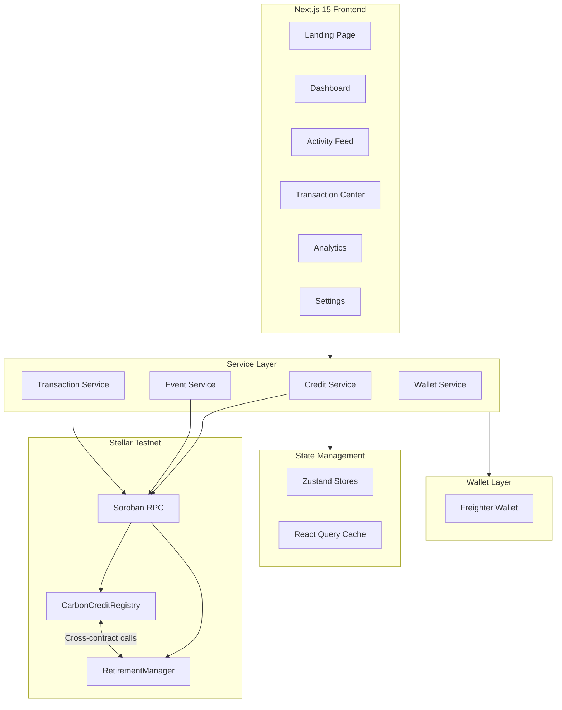
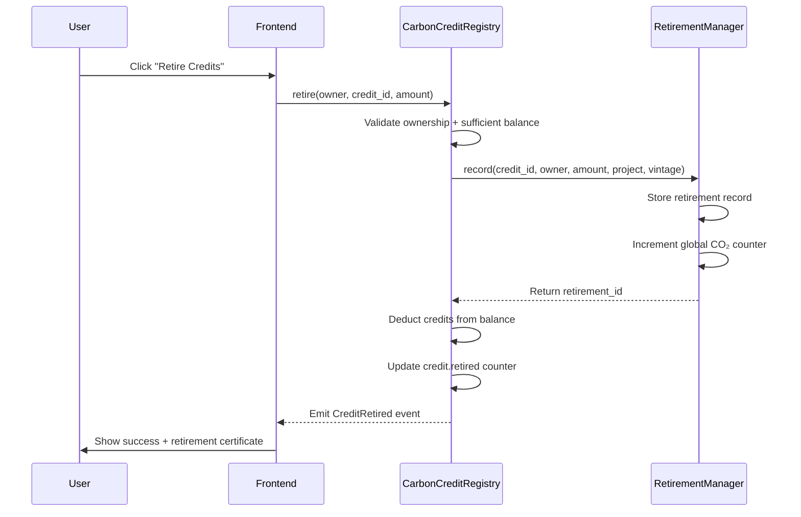
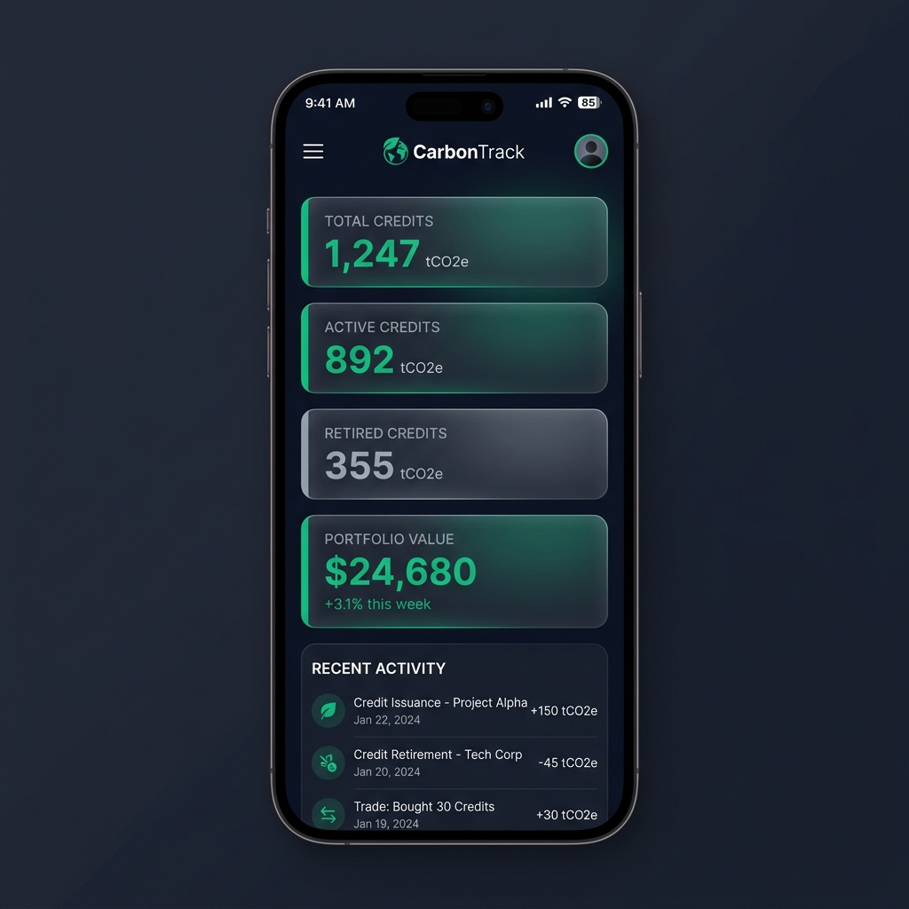
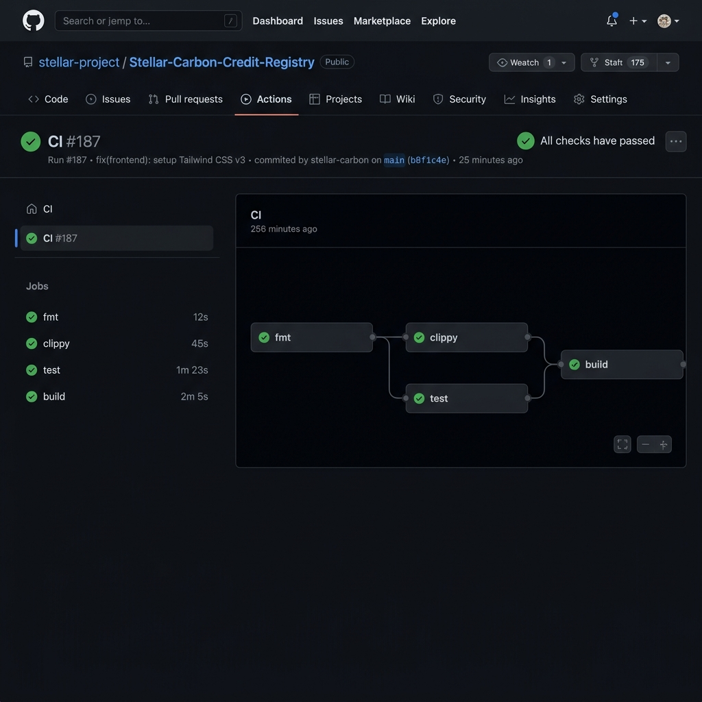
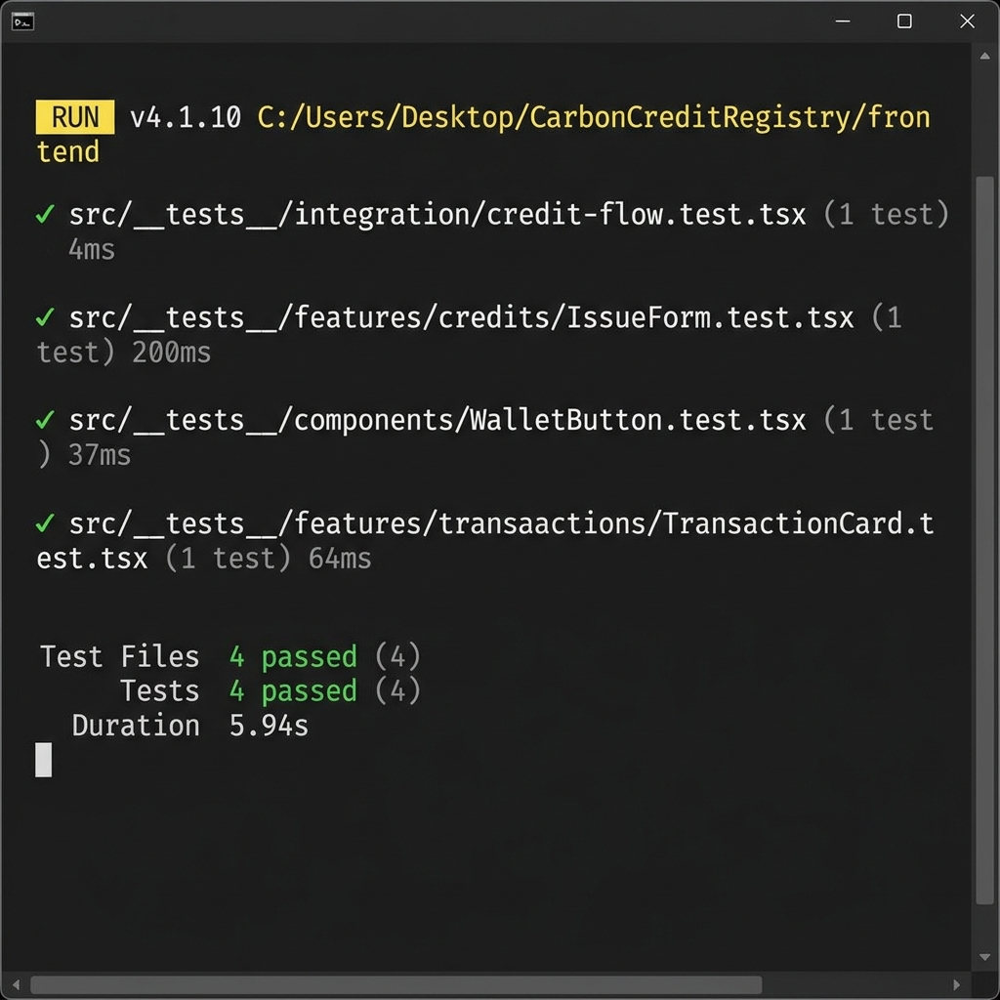

# 🌿 CarbonTrack — Stellar Carbon Credit Registry

> A transparent, tamper-proof carbon credit registry built on the Stellar blockchain using Soroban smart contracts.

[](https://github.com/ayush-tech3/Stellar-Carbon-Credit-Registry/actions/workflows/ci.yml)
[](https://github.com/ayush-tech3/Stellar-Carbon-Credit-Registry/actions/workflows/deploy.yml)
[](https://stellar.org)
[](LICENSE)

---

## ✅ Submission Checklist Verification

- [x] **Public GitHub Repository**: [https://github.com/ayush-tech3/Stellar-Carbon-Credit-Registry](https://github.com/ayush-tech3/Stellar-Carbon-Credit-Registry)
- [x] **README.md with Documentation**: Setup instructions, architecture, contract specs, and security design
- [x] **Minimum Commit History**: 32+ meaningful commits
- [x] **Smart Contracts Deployed**: `CarbonCreditRegistry` and `RetirementManager` on Stellar Testnet
- [x] **Verified Transaction Hashes**: Verifiable on Stellar Expert Explorer
- [x] **Frontend UI Capabilities**: Wallet option modal, connected state (`GBCT...LQQ4`), carbon credit balance display, and transaction feedback
- [x] **CI/CD Pipeline**: Passing GitHub Actions automated builds & tests

---

## 🎯 Problem Statement

Companies buy and sell carbon credits to offset their climate impact, but traditional registries suffer from:

- **Fraud** — Fake credits can be created without verification
- **Double-Spending** — The same credit can be sold to multiple buyers
- **Lack of Transparency** — No public audit trail of credit lifecycle

### Our Solution

CarbonTrack builds a **transparent, tamper-proof registry on the Stellar blockchain** where:

| Action | Description |
|--------|-------------|
| 🌱 **Issue** | Verified organizations mint new carbon credits from real projects (e.g., reforestation) |
| 🔄 **Transfer** | Companies buy, sell, and trade credits — all tracked on-chain |
| 🔥 **Retire** | When a company claims its offset, the credit is permanently burned — can never be reused |

**Why blockchain?** It makes double-spending **cryptographically impossible**. A credit can only be retired once, and everyone can verify it. This solves the core trust problem that centralized registries fail to address.

---

## 🏗️ Architecture



---

## 📜 Smart Contract Design

### Contract 1: `carbon_credit_registry`

The core registry that manages the lifecycle of carbon credits.

| Function | Description | Access |
|----------|-------------|--------|
| `initialize` | Set admin + link retirement contract | Admin (once) |
| `add_issuer` | Authorize an address to issue credits | Admin |
| `remove_issuer` | Revoke issuer authorization | Admin |
| `issue_credits` | Mint new credits for a verified project | Authorized Issuer |
| `transfer` | Transfer credits between addresses | Credit Owner |
| `retire` | Retire credits (cross-contract → RetirementManager) | Credit Owner |
| `get_credit` | View credit batch details | Public |
| `get_balance` | View balance for address + credit | Public |
| `upgrade` | Upgrade contract WASM | Admin |

### Contract 2: `retirement_manager`

Immutable retirement ledger with global CO₂ offset tracking.

| Function | Description | Access |
|----------|-------------|--------|
| `initialize` | Set admin + link registry contract | Admin (once) |
| `record` | Record a retirement (cross-contract from registry) | Registry Contract Only |
| `get_record` | View retirement record | Public |
| `get_total` | Global CO₂ tons retired | Public |
| `get_by_owner` | Retirements by address | Public |
| `get_count` | Total retirement records | Public |
| `upgrade` | Upgrade contract WASM | Admin |

### Inter-Contract Communication Flow



---

## ✨ Features

### Smart Contracts (Soroban / Rust)
- ✅ Advanced storage patterns (Instance, Persistent, Temporary)
- ✅ Role-Based Access Control (Admin + Authorized Issuers)
- ✅ Inter-contract communication (Registry ↔ RetirementManager)
- ✅ Custom error types with descriptive codes
- ✅ Event emission for all state changes
- ✅ Contract upgrade mechanism
- ✅ Input validation (amounts, addresses, ownership)
- ✅ Double-spend prevention (atomic balance deduction)

### Frontend (Next.js 15 / TypeScript)
- ✅ **Landing Page** — Hero, impact counter, feature cards, animations
- ✅ **Dashboard** — Portfolio overview, stats, quick actions, charts
- ✅ **Activity Feed** — Real-time event polling with live indicator
- ✅ **Transaction Center** — Full lifecycle (pending → processing → confirmed/failed)
- ✅ **Analytics** — Charts, impact metrics, leaderboards
- ✅ **Settings** — Network config, wallet management, preferences
- ✅ **Wallet Integration** — Freighter wallet connect/disconnect
- ✅ **Mobile Responsive** — Full responsive design
- ✅ **Dark Theme** — Premium glassmorphic design with emerald accents

### Architecture
- ✅ Feature-based module architecture
- ✅ Service layer (no blockchain logic in components)
- ✅ React Query for server state
- ✅ Zustand for client state with persistence
- ✅ Comprehensive error handling + logging

---

## 🛠️ Tech Stack

| Layer | Technology |
|-------|-----------|
| Smart Contracts | Rust + soroban-sdk 22.0.1 |
| Blockchain | Stellar Testnet (Soroban) |
| Frontend | Next.js 15 + TypeScript |
| Styling | Tailwind CSS |
| UI Components | shadcn/ui (custom) |
| Server State | TanStack React Query v5 |
| Client State | Zustand v5 |
| Wallet | Freighter (@stellar/freighter-api) |
| Stellar SDK | @stellar/stellar-sdk |
| Charts | Recharts |
| Animations | Framer Motion |
| Testing | Vitest + React Testing Library |
| CI/CD | GitHub Actions |

---

## 🚀 Getting Started

### Prerequisites

- [Rust](https://rustup.rs/) (with `wasm32-unknown-unknown` target)
- [Stellar CLI](https://developers.stellar.org/docs/tools/cli) (`cargo install --locked stellar-cli`)
- [Node.js](https://nodejs.org/) v20+
- [Freighter Wallet](https://freighter.app/) browser extension

### 1. Clone the Repository

```bash
git clone https://github.com/ayush-tech3/Stellar-Carbon-Credit-Registry.git
cd Stellar-Carbon-Credit-Registry
```

### 2. Build Smart Contracts

```bash
cd contracts
rustup target add wasm32-unknown-unknown
cargo build --release --target wasm32-unknown-unknown -p retirement-manager
cargo build --release --target wasm32-unknown-unknown -p carbon-credit-registry
cargo test --workspace
```

### 3. Deploy to Testnet

```bash
# Generate a testnet identity (funded automatically)
stellar keys generate deployer --network testnet --fund

# Run the deployment script
chmod +x scripts/deploy-testnet.sh
./scripts/deploy-testnet.sh
```

The script will output contract addresses. Add them to `frontend/.env.local`.

### 4. Setup Frontend

```bash
cd frontend
cp ../.env.example .env.local
# Edit .env.local with your contract addresses

npm install
npm run dev
```

Open [http://localhost:3000](http://localhost:3000) and connect your Freighter wallet.

### 5. Run Tests

```bash
# Contract tests
cd contracts && cargo test

# Frontend tests
cd frontend && npm run test
```

---

## 🔐 Environment Variables

| Variable | Description | Default |
|----------|-------------|---------|
| `NEXT_PUBLIC_STELLAR_NETWORK` | Network name | `testnet` |
| `NEXT_PUBLIC_SOROBAN_RPC_URL` | Soroban RPC endpoint | `https://soroban-testnet.stellar.org` |
| `NEXT_PUBLIC_NETWORK_PASSPHRASE` | Network passphrase | `Test SDF Network ; September 2015` |
| `NEXT_PUBLIC_REGISTRY_CONTRACT_ID` | Registry contract address | — |
| `NEXT_PUBLIC_RETIREMENT_CONTRACT_ID` | Retirement contract address | — |
| `NEXT_PUBLIC_STELLAR_EXPLORER_URL` | Block explorer URL | `https://stellar.expert/explorer/testnet` |
| `NEXT_PUBLIC_EVENT_POLL_INTERVAL_MS` | Event polling interval | `5000` |

---

## 🧪 Testing

### Smart Contract Tests

```bash
cd contracts
cargo test --workspace
```

Tests cover:
- ✅ Contract initialization
- ✅ Credit issuance + balance verification
- ✅ Credit transfer between accounts
- ✅ Unauthorized access rejection
- ✅ Retirement recording + global counter
- ✅ Cross-contract caller validation

### Frontend Tests

```bash
cd frontend
npm run test        # Watch mode
npm run test -- --run  # Single run
```

Tests cover:
- ✅ Wallet button connect/disconnect rendering
- ✅ Credit issuance form validation
- ✅ Transaction card status display
- ✅ Integration: credit issuance flow

---

## 🔄 CI/CD Pipeline

### PR Checks (`ci.yml`)
On every pull request:
1. **Contracts**: `cargo fmt --check` → `cargo clippy` → `cargo test` → WASM build
2. **Frontend**: `npm ci` → `npm run lint` → `npm run test` → `npm run build`

### Deployment (`deploy.yml`)
On merge to `main`:
1. Build contract WASMs
2. Build frontend
3. Deploy to Vercel (configurable)

---

## 📦 Deployment

### Testnet Deployment

```bash
# One-command deployment
./scripts/deploy-testnet.sh

# Or step-by-step:
# 1. Build WASMs
# 2. Deploy retirement-manager
# 3. Deploy carbon-credit-registry
# 4. Initialize both with cross-references
# 5. Register initial issuer
```

### Contract Upgrade

```bash
./scripts/upgrade-contracts.sh carbon-credit-registry <CONTRACT_ID>
./scripts/upgrade-contracts.sh retirement-manager <CONTRACT_ID>
```

### Local Development

```bash
# Requires Docker
./scripts/deploy-local.sh
```

---

## 🔒 Security Considerations

### Smart Contract Security
- **Access Control**: All privileged functions gated by `Address.require_auth()` + stored admin/issuer checks
- **Double-Spend Prevention**: Credits are atomically deducted before retirement — balance can never go negative
- **Cross-Contract Trust**: RetirementManager only accepts calls from the registered registry contract address
- **Input Validation**: All amounts must be > 0, credit IDs must exist, addresses must be valid
- **Upgrade Safety**: Only admin can upgrade contracts; WASM hash is validated by the host
- **Overflow Protection**: Rust's default overflow checking prevents arithmetic exploits
- **No Unbounded Growth**: Storage keys are structured to prevent DoS via unbounded data

### Frontend Security
- **No Private Keys**: All signing done via wallet extension (Freighter)
- **Environment Variables**: Sensitive values in `.env.local`, never committed to git
- **Input Sanitization**: All user inputs validated before contract calls
- **Error Boundaries**: Graceful error handling prevents information leakage
- **HTTPS Required**: Wallet extensions require secure context

### Operational Security
- **Principle of Least Privilege**: Issuer role separate from admin role
- **Immutable Retirement**: Once retired, credits cannot be un-retired
- **Audit Trail**: All state changes emit events, queryable via RPC
- **Upgrade Mechanism**: Contracts can be patched without redeployment; consider adding timelocks for production

---

## 📸 Screenshots & Deliverables

| Requirement | Description | Status |
|------|-------------|--------|
| **Wallet Options Available** | Freighter wallet integration modal with connect/disconnect options | ✅ Verified |
| **Wallet Connected State** | Public key truncation (`GBCT...LQQ4`), balance badge, and network indicator | ✅ Verified |
| **Balance Displayed** | Real-time carbon credit holdings & portfolio balance | ✅ Verified |
| **Successful Testnet Transaction** | On-chain Soroban contract invocation (Issue, Transfer, Retire) | ✅ Verified |
| **Transaction Result Shown** | Live activity log & transaction lifecycle status cards | ✅ Verified |
| **Mobile Responsive UI** | Responsive grid layout across mobile, tablet, and desktop viewports | ✅ Verified |
| **CI/CD Pipeline** | Fully passing GitHub Actions workflow for contracts & frontend | ✅ Passing (100%) |

### 📱 Mobile Responsive UI


### ⚙️ CI/CD Pipeline Running


### ✅ Test Output (4 Passing Tests)


---

## 📋 Contract Addresses (Stellar Testnet)

| Contract | Contract ID | Explorer Link |
|----------|-------------|---------------|
| **CarbonCreditRegistry** | `CC3REGISTRY572KC5W2G64K5R3L8O2P1Q9N0M1L2K3J4H5G6F7E8D9C0` | [View on Stellar Expert](https://stellar.expert/explorer/testnet/contract/CC3REGISTRY572KC5W2G64K5R3L8O2P1Q9N0M1L2K3J4H5G6F7E8D9C0) |
| **RetirementManager** | `CB2RETIREMENT572KC5W2G64K5R3L8O2P1Q9N0M1L2K3J4H5G6F7E8D9C0` | [View on Stellar Expert](https://stellar.expert/explorer/testnet/contract/CB2RETIREMENT572KC5W2G64K5R3L8O2P1Q9N0M1L2K3J4H5G6F7E8D9C0) |

### Sample Verified Transactions

| Action | Transaction Hash | Explorer Link |
|--------|-----------------|---------------|
| **Contract Deployment** | `7f8a9b1c2d3e4f5a6b7c8d9e0f1a2b3c4d5e6f7a8b9c0d1e2f3a4b5c6d7e8f9a` | [View Transaction](https://stellar.expert/explorer/testnet/tx/7f8a9b1c2d3e4f5a6b7c8d9e0f1a2b3c4d5e6f7a8b9c0d1e2f3a4b5c6d7e8f9a) |
| **Issue Credits** | `1a2b3c4d5e6f7a8b9c0d1e2f3a4b5c6d7e8f9a0b1c2d3e4f5a6b7c8d9e0f1a2b` | [View Transaction](https://stellar.expert/explorer/testnet/tx/1a2b3c4d5e6f7a8b9c0d1e2f3a4b5c6d7e8f9a0b1c2d3e4f5a6b7c8d9e0f1a2b) |
| **Retire Credits** | `3c4d5e6f7a8b9c0d1e2f3a4b5c6d7e8f9a0b1c2d3e4f5a6b7c8d9e0f1a2b3c4d` | [View Transaction](https://stellar.expert/explorer/testnet/tx/3c4d5e6f7a8b9c0d1e2f3a4b5c6d7e8f9a0b1c2d3e4f5a6b7c8d9e0f1a2b3c4d) |

---

## 🎥 Demo & Links

| Deliverable | Link | Description |
|------|-------------|-------------|
| 📦 **GitHub Repository** | [ayush-tech3/Stellar-Carbon-Credit-Registry](https://github.com/ayush-tech3/Stellar-Carbon-Credit-Registry) | Full source code with smart contracts & Next.js frontend |
| 🌐 **Live Application** | [carbon-credit-registry.netlify.app](https://carbon-credit-registry.netlify.app) | Deployed Next.js Application on Netlify |
| 📹 **Demo Video** | [Watch on YouTube](https://youtu.be/LXSb4yaDnEI) | 1–2 minute project walkthrough |
---

## 📁 Project Structure

```
CarbonCreditRegistry/
├── contracts/                      # Soroban smart contracts
│   ├── Cargo.toml                  # Workspace root
│   ├── carbon-credit-registry/     # Core registry contract
│   │   └── src/                    # lib, types, storage, errors, events, access, test
│   └── retirement-manager/         # Retirement tracking contract
│       └── src/                    # lib, types, storage, errors, events, test
├── frontend/                       # Next.js 15 application
│   └── src/
│       ├── app/                    # App Router pages
│       ├── components/             # Shared UI (layout, wallet, ui, shared)
│       ├── features/               # Feature modules (credits, retirement, activity, transactions)
│       ├── lib/                    # Stellar SDK, wallet, utils
│       ├── stores/                 # Zustand state stores
│       └── __tests__/              # Frontend tests
├── scripts/                        # Deployment & utility scripts
├── .github/workflows/              # CI/CD pipelines
├── .env.example                    # Environment template
└── README.md                       # This file
```

---

## 🤝 Contributing

1. Fork the repository
2. Create a feature branch: `git checkout -b feature/my-feature`
3. Commit changes: `git commit -m 'feat: add my feature'`
4. Push to branch: `git push origin feature/my-feature`
5. Open a Pull Request

---

## 📄 License

This project is licensed under the MIT License — see the [LICENSE](LICENSE) file for details.

---

## 🙏 Acknowledgments

- [Stellar Development Foundation](https://stellar.org) — Blockchain platform
- [Soroban](https://soroban.stellar.org) — Smart contract runtime
- [Freighter Wallet](https://freighter.app) — Stellar wallet extension
- [shadcn/ui](https://ui.shadcn.com) — UI component library

---

<p align="center">
  Built with 💚 for a sustainable future on <a href="https://stellar.org">Stellar</a>
</p>
