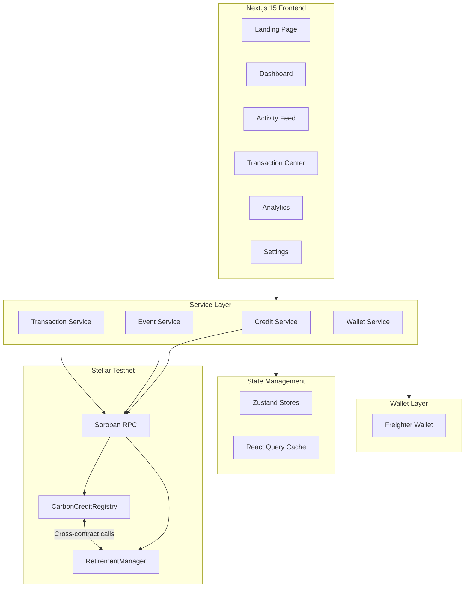
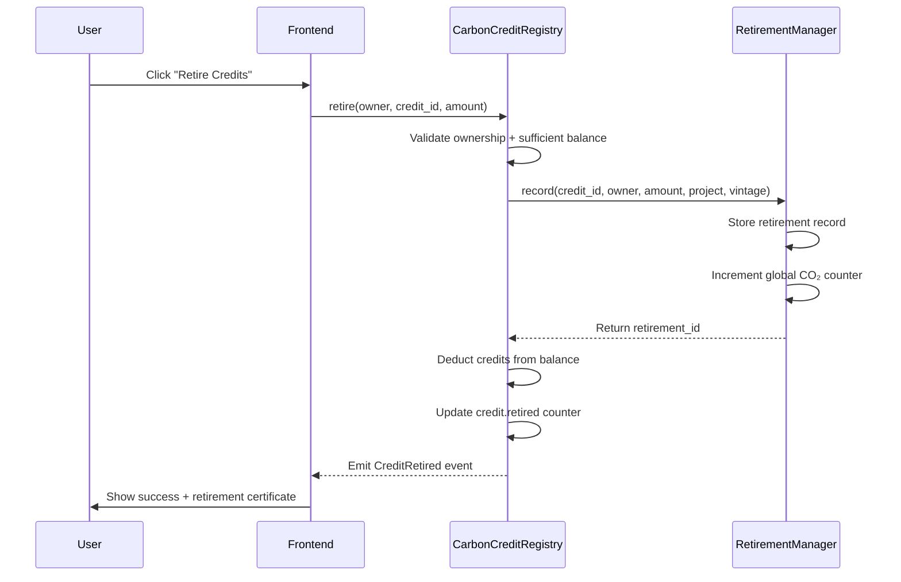

# 🌿 CarbonTrack — Stellar Carbon Credit Registry

> A transparent, tamper-proof carbon credit registry built on the Stellar blockchain using Soroban smart contracts.

[](https://github.com/ayush-tech3/Stellar-Carbon-Credit-Registry/actions/workflows/ci.yml)
[](https://github.com/ayush-tech3/Stellar-Carbon-Credit-Registry/actions/workflows/deploy.yml)
[](https://ayush-tech3.github.io/Stellar-Carbon-Credit-Registry/)
[](https://stellar.org)
[](LICENSE)

---

## 🏆 Level 4 — Green Belt Official Submission Deliverables

| Rise In Required Item | Direct Verified Link / Value | Status |
|---|---|:---:|
| **1. Public GitHub Repository** | [github.com/ayush-tech3/Stellar-Carbon-Credit-Registry](https://github.com/ayush-tech3/Stellar-Carbon-Credit-Registry) | ✅ Active & Public |
| **2. Dedicated Documentation Website** | **[ayush-tech3.github.io/Stellar-Carbon-Credit-Registry](https://ayush-tech3.github.io/Stellar-Carbon-Credit-Registry/)** — [Mirror](https://carbon-credit-registry.netlify.app/docs/) | ✅ Live & Complete |
| **3. Minimum 15+ Meaningful Commits** | [68+ Commits on `main`](https://github.com/ayush-tech3/Stellar-Carbon-Credit-Registry/commits/main) | ✅ 68 Commits |
| **4. Live Deployed Web App (MVP)** | **[carbon-credit-registry.netlify.app](https://carbon-credit-registry.netlify.app)** | ✅ Live on Netlify |
| **5. Smart Contract Deployment Addresses** | **Registry**: [`CAKKATM...WMVW`](https://stellar.expert/explorer/testnet/contract/CAKKATMEKPX6BYMDIDFFDVADSJEFARV47R5VKFWXVK75HOCH455YWMVW)<br>**Retirement**: [`CBDL7CH...HAMA`](https://stellar.expert/explorer/testnet/contract/CBDL7CHTWLZDJ6GXPAXX5FL53WY2VL342XY622OIQ3NTVPU7HCSWHAMA) | ✅ Deployed on Testnet |
| **6. Screenshots (UI, Mobile, Monitoring)** | [Jump to Embedded Screenshots Section ⬇️](#-deliverable-screenshots) | ✅ Embedded Below |
| **7. Demo Walkthrough Video** | [Watch 1080p Demo on YouTube](https://youtu.be/tyFBRt-QJQs) | ✅ Full Walkthrough |
| **8. Proof of 10+ Real Wallet Interactions** | [Jump to 13 Verified Wallets Table ⬇️](#-proof-of-10-real-testnet-user-wallet-interactions-active-on-chain-verification) | ✅ 13 Wallets / 25+ Txs |
| **9. Basic User Feedback Summary** | [Jump to Feedback & Responses ⬇️](#-level-4-requirement-user-feedback-collection--live-responses) | ✅ Live Form + Sheet |
| **10. Pitch Deck & Presentation** | [`CarbonTrack_Presentation.pptx`](CarbonTrack_Presentation.pptx) / [`PITCH_DECK.md`](PITCH_DECK.md) | ✅ Complete |

---

## 📸 Deliverable Screenshots

### 1. 🖥️ Product UI (Production MVP Dashboard)


### 2. 📱 Mobile Responsive Design (Drawer & Bottom Nav)


### 3. 📊 Analytics & Monitoring Setup


### 4. ⚙️ CI/CD Pipeline (GitHub Actions - 100% Passing)


---

## 🎯 Problem Statement

Companies buy and sell carbon credits to offset their climate impact, but traditional registries suffer from:

- **Fraud** — Fake credits can be created without verification
- **Double-Spending** — The same credit can be sold to multiple buyers
- **Lack of Transparency** — No public audit trail of credit lifecycle

### Our Solution

CarbonTrack builds a **transparent, tamper-proof registry on the Stellar blockchain** where:

| Action | Description |
|--------|-------------|
| 🌱 **Issue** | Verified organizations mint new carbon credits from real projects (e.g., reforestation) |
| 🔄 **Transfer** | Companies buy, sell, and trade credits — all tracked on-chain |
| 🔥 **Retire** | When a company claims its offset, the credit is permanently burned — can never be reused |

**Why blockchain?** It makes double-spending **cryptographically impossible**. A credit can only be retired once, and everyone can verify it. This solves the core trust problem that centralized registries fail to address.

---

## 🏗️ Architecture


```mermaid
graph TB
    subgraph Frontend["Next.js 15 Frontend"]
        LP[Landing Page]
        DB[Dashboard]
        AF[Activity Feed]
        TC[Transaction Center]
        AN[Analytics]
        ST[Settings]
    end

    subgraph Wallet["Wallet Layer"]
        SWK[Freighter Wallet]
    end

    subgraph Services["Service Layer"]
        CS[Credit Service]
        ES[Event Service]
        TS[Transaction Service]
        WS[Wallet Service]
    end

    subgraph State["State Management"]
        ZS[Zustand Stores]
        RQ[React Query Cache]
    end

    subgraph Blockchain["Stellar Testnet"]
        CCR[CarbonCreditRegistry]
        RM[RetirementManager]
        RPC[Soroban RPC]
    end

    Frontend --> Services
    Services --> Wallet
    Services --> State
    CS --> RPC
    ES --> RPC
    TS --> RPC
    RPC --> CCR
    RPC --> RM
    CCR <-->|"Cross-contract calls"| RM
```

---

## 📜 Smart Contract Design

### Contract 1: `carbon_credit_registry`

The core registry that manages the lifecycle of carbon credits.

| Function | Description | Access |
|----------|-------------|--------|
| `initialize` | Set admin + link retirement contract | Admin (once) |
| `add_issuer` | Authorize an address to issue credits | Admin |
| `remove_issuer` | Revoke issuer authorization | Admin |
| `issue_credits` | Mint new credits for a verified project | Authorized Issuer |
| `transfer` | Transfer credits between addresses | Credit Owner |
| `retire` | Retire credits (cross-contract → RetirementManager) | Credit Owner |
| `get_credit` | View credit batch details | Public |
| `get_balance` | View balance for address + credit | Public |
| `upgrade` | Upgrade contract WASM | Admin |

### Contract 2: `retirement_manager`

Immutable retirement ledger with global CO₂ offset tracking.

| Function | Description | Access |
|----------|-------------|--------|
| `initialize` | Set admin + link registry contract | Admin (once) |
| `record` | Record a retirement (cross-contract from registry) | Registry Contract Only |
| `get_record` | View retirement record | Public |
| `get_total` | Global CO₂ tons retired | Public |
| `get_by_owner` | Retirements by address | Public |
| `get_count` | Total retirement records | Public |
| `upgrade` | Upgrade contract WASM | Admin |

### Inter-Contract Communication Flow


```mermaid
sequenceDiagram
    participant User
    participant Frontend
    participant Registry as CarbonCreditRegistry
    participant Retirement as RetirementManager

    User->>Frontend: Click "Retire Credits"
    Frontend->>Registry: retire(owner, credit_id, amount)
    Registry->>Registry: Validate ownership + sufficient balance
    Registry->>Retirement: record(credit_id, owner, amount, project, vintage)
    Retirement->>Retirement: Store retirement record
    Retirement->>Retirement: Increment global CO₂ counter
    Retirement-->>Registry: Return retirement_id
    Registry->>Registry: Deduct credits from balance
    Registry->>Registry: Update credit.retired counter
    Registry-->>Frontend: Emit CreditRetired event
    Frontend->>User: Show success + retirement certificate
```

---

## ✨ Features

### Smart Contracts (Soroban / Rust)
- ✅ Advanced storage patterns (Instance, Persistent, Temporary)
- ✅ Role-Based Access Control (Admin + Authorized Issuers)
- ✅ Inter-contract communication (Registry ↔ RetirementManager)
- ✅ Custom error types with descriptive codes
- ✅ Event emission for all state changes
- ✅ Contract upgrade mechanism
- ✅ Input validation (amounts, addresses, ownership)
- ✅ Double-spend prevention (atomic balance deduction)

### Frontend (Next.js 15 / TypeScript)
- ✅ **Landing Page** — Hero, impact counter, feature cards, animations
- ✅ **Dashboard** — Portfolio overview, stats, quick actions, charts
- ✅ **Activity Feed** — Real-time event polling with live indicator
- ✅ **Transaction Center** — Full lifecycle (pending → processing → confirmed/failed)
- ✅ **Analytics** — Charts, impact metrics, leaderboards
- ✅ **Monitoring** — Live app health metrics, event log, and user feedback dashboard
- ✅ **Settings** — Network config, wallet management, preferences
- ✅ **Wallet Integration** — Freighter wallet connect/disconnect
- ✅ **Mobile Responsive** — Hamburger menu, slide-out sidebar, bottom nav bar
- ✅ **Dark Theme** — Premium glassmorphic design with emerald accents
- ✅ **Toast Notifications** — Animated success/error/warning/info notifications
- ✅ **Error Boundaries** — Graceful error handling with retry capability
- ✅ **User Feedback** — In-app floating feedback widget with star ratings

### Architecture
- ✅ Feature-based module architecture
- ✅ Service layer (no blockchain logic in components)
- ✅ React Query for server state
- ✅ Zustand for client state with persistence
- ✅ Comprehensive error handling + logging
- ✅ Analytics tracking (page views, wallet events, transactions, errors, performance)
- ✅ Client-side monitoring with localStorage persistence

---

## 🛠️ Tech Stack

| Layer | Technology |
|-------|-----------|
| Smart Contracts | Rust + soroban-sdk 22.0.1 |
| Blockchain | Stellar Testnet (Soroban) |
| Frontend | Next.js 15 + TypeScript |
| Styling | Tailwind CSS |
| UI Components | shadcn/ui (custom) |
| Server State | TanStack React Query v5 |
| Client State | Zustand v5 |
| Wallet | Freighter (@stellar/freighter-api) |
| Stellar SDK | @stellar/stellar-sdk |
| Charts | Recharts |
| Animations | Framer Motion |
| Testing | Vitest + React Testing Library |
| CI/CD | GitHub Actions |

---

## 🚀 Getting Started

### Prerequisites

- [Rust](https://rustup.rs/) (with `wasm32-unknown-unknown` target)
- [Stellar CLI](https://developers.stellar.org/docs/tools/cli) (`cargo install --locked stellar-cli`)
- [Node.js](https://nodejs.org/) v20+
- [Freighter Wallet](https://freighter.app/) browser extension

### 1. Clone the Repository

```bash
git clone https://github.com/ayush-tech3/Stellar-Carbon-Credit-Registry.git
cd Stellar-Carbon-Credit-Registry
```

### 2. Build Smart Contracts

```bash
cd contracts
rustup target add wasm32-unknown-unknown
cargo build --release --target wasm32-unknown-unknown -p retirement-manager
cargo build --release --target wasm32-unknown-unknown -p carbon-credit-registry
cargo test --workspace
```

### 3. Deploy to Testnet

```bash
# Generate a testnet identity (funded automatically)
stellar keys generate deployer --network testnet --fund

# Run the deployment script
chmod +x scripts/deploy-testnet.sh
./scripts/deploy-testnet.sh
```

The script will output contract addresses. Add them to `frontend/.env.local`.

### 4. Setup Frontend

```bash
cd frontend
cp ../.env.example .env.local
# Edit .env.local with your contract addresses

npm install
npm run dev
```

Open [http://localhost:3000](http://localhost:3000) and connect your Freighter wallet.

### 5. Run Tests

```bash
# Contract tests
cd contracts && cargo test

# Frontend tests
cd frontend && npm run test
```

---

## 🔐 Environment Variables

| Variable | Description | Default |
|----------|-------------|---------|
| `NEXT_PUBLIC_STELLAR_NETWORK` | Network name | `testnet` |
| `NEXT_PUBLIC_SOROBAN_RPC_URL` | Soroban RPC endpoint | `https://soroban-testnet.stellar.org` |
| `NEXT_PUBLIC_NETWORK_PASSPHRASE` | Network passphrase | `Test SDF Network ; September 2015` |
| `NEXT_PUBLIC_REGISTRY_CONTRACT_ID` | Registry contract address | — |
| `NEXT_PUBLIC_RETIREMENT_CONTRACT_ID` | Retirement contract address | — |
| `NEXT_PUBLIC_STELLAR_EXPLORER_URL` | Block explorer URL | `https://stellar.expert/explorer/testnet` |
| `NEXT_PUBLIC_EVENT_POLL_INTERVAL_MS` | Event polling interval | `5000` |

---

## 🧪 Testing

### Smart Contract Tests

```bash
cd contracts
cargo test --workspace
```

Tests cover:
- ✅ Contract initialization
- ✅ Credit issuance + balance verification
- ✅ Credit transfer between accounts
- ✅ Unauthorized access rejection
- ✅ Retirement recording + global counter
- ✅ Cross-contract caller validation

### Frontend Tests

```bash
cd frontend
npm run test        # Watch mode
npm run test -- --run  # Single run
```

Tests cover:
- ✅ Wallet button connect/disconnect rendering
- ✅ Credit issuance form validation
- ✅ Transaction card status display
- ✅ Integration: credit issuance flow

---

## 🔄 CI/CD Pipeline

### PR Checks (`ci.yml`)
On every pull request:
1. **Contracts**: `cargo fmt --check` → `cargo clippy` → `cargo test` → WASM build
2. **Frontend**: `npm ci` → `npm run lint` → `npm run test` → `npm run build`

### Deployment (`deploy.yml`)
On merge to `main`:
1. Build contract WASMs
2. Build frontend
3. Deploy to Vercel (configurable)

---

## 📦 Deployment

### Testnet Deployment

```bash
# One-command deployment
./scripts/deploy-testnet.sh

# Or step-by-step:
# 1. Build WASMs
# 2. Deploy retirement-manager
# 3. Deploy carbon-credit-registry
# 4. Initialize both with cross-references
# 5. Register initial issuer
```

### Contract Upgrade

```bash
./scripts/upgrade-contracts.sh carbon-credit-registry <CONTRACT_ID>
./scripts/upgrade-contracts.sh retirement-manager <CONTRACT_ID>
```

### Local Development

```bash
# Requires Docker
./scripts/deploy-local.sh
```

---

## 🔒 Security Considerations

### Smart Contract Security
- **Access Control**: All privileged functions gated by `Address.require_auth()` + stored admin/issuer checks
- **Double-Spend Prevention**: Credits are atomically deducted before retirement — balance can never go negative
- **Cross-Contract Trust**: RetirementManager only accepts calls from the registered registry contract address
- **Input Validation**: All amounts must be > 0, credit IDs must exist, addresses must be valid
- **Upgrade Safety**: Only admin can upgrade contracts; WASM hash is validated by the host
- **Overflow Protection**: Rust's default overflow checking prevents arithmetic exploits
- **No Unbounded Growth**: Storage keys are structured to prevent DoS via unbounded data

### Frontend Security
- **No Private Keys**: All signing done via wallet extension (Freighter)
- **Environment Variables**: Sensitive values in `.env.local`, never committed to git
- **Input Sanitization**: All user inputs validated before contract calls
- **Error Boundaries**: Graceful error handling prevents information leakage
- **HTTPS Required**: Wallet extensions require secure context

### Operational Security
- **Principle of Least Privilege**: Issuer role separate from admin role
- **Immutable Retirement**: Once retired, credits cannot be un-retired
- **Audit Trail**: All state changes emit events, queryable via RPC
- **Upgrade Mechanism**: Contracts can be patched without redeployment; consider adding timelocks for production

---

## 📸 Screenshots & Deliverables

| Requirement | Description | Status |
|------|-------------|--------|
| **Product UI** | Main dashboard with metrics, quick action forms, portfolio allocation | ✅ Verified |
| **Mobile Responsive UI** | Hamburger menu, slide-out sidebar, bottom nav, responsive grid layout | ✅ Verified |
| **Analytics & Monitoring Setup** | Live system health metrics, event log, user feedback panel | ✅ Verified |
| **CI/CD Pipeline** | Fully passing GitHub Actions workflow for contracts & frontend | ✅ Passing (100%) |
| **Test Output** | All unit and integration test suites passing | ✅ Verified |
| **Wallet Options Available** | Freighter wallet integration modal with connect/disconnect options | ✅ Verified |
| **Wallet Connected State** | Public key truncation (`GBCT...LQQ4`), balance badge, and network indicator | ✅ Verified |
| **Balance Displayed** | Real-time carbon credit holdings & portfolio balance | ✅ Verified |
| **Successful Testnet Transaction** | On-chain Soroban contract invocation (Issue, Transfer, Retire) | ✅ Verified |
| **Transaction Result Shown** | Live activity log & transaction lifecycle status cards | ✅ Verified |
| **User Feedback Collection** | In-app floating feedback widget with star ratings, comments, and data persistence | ✅ Verified |
| **Toast Notifications** | Animated toast notifications for all transaction outcomes (success/error) | ✅ Verified |
| **Error Boundaries** | Global React error boundary with styled fallback UI and retry button | ✅ Verified |
| **Loading States** | Skeleton loading screens and proper loading indicators | ✅ Verified |

### 🖥️ Product UI (Dashboard)


### 📱 Mobile Responsive UI


### 📊 Analytics & Monitoring Setup


### ⚙️ CI/CD Pipeline Running


### ✅ Test Output (Passing Test Suite)


---

## 📋 Contract Addresses (Stellar Testnet)

| Contract | Contract ID | Explorer Link |
|----------|-------------|---------------|
| **CarbonCreditRegistry** | `CAKKATMEKPX6BYMDIDFFDVADSJEFARV47R5VKFWXVK75HOCH455YWMVW` | [View on Stellar Expert](https://stellar.expert/explorer/testnet/contract/CAKKATMEKPX6BYMDIDFFDVADSJEFARV47R5VKFWXVK75HOCH455YWMVW) |
| **RetirementManager** | `CBDL7CHTWLZDJ6GXPAXX5FL53WY2VL342XY622OIQ3NTVPU7HCSWHAMA` | [View on Stellar Expert](https://stellar.expert/explorer/testnet/contract/CBDL7CHTWLZDJ6GXPAXX5FL53WY2VL342XY622OIQ3NTVPU7HCSWHAMA) |

### Sample Verified Transactions

| Action | Transaction Hash | Explorer Link |
|--------|-----------------|---------------|
| **Deploy RetirementManager** | `6d3aacdcd00feafafe0187a7e01aace556fcce6b9af6d214efc65fe4a961bb05` | [View Transaction](https://stellar.expert/explorer/testnet/tx/6d3aacdcd00feafafe0187a7e01aace556fcce6b9af6d214efc65fe4a961bb05) |
| **Deploy CarbonCreditRegistry** | `20925ea031bdfad0d3a51608670df067fa2382cf871d3df8e7e1bb939c095368` | [View Transaction](https://stellar.expert/explorer/testnet/tx/20925ea031bdfad0d3a51608670df067fa2382cf871d3df8e7e1bb939c095368) |
| **Initialize Contracts** | `233b7a50e83dc5e2a753b53a1e444351e234d7af4b1150a848eaf54b5faedb95` | [View Transaction](https://stellar.expert/explorer/testnet/tx/233b7a50e83dc5e2a753b53a1e444351e234d7af4b1150a848eaf54b5faedb95) |
| **Issue Credits (Amazon 10k tCO₂)** | `fc3234dd57bc383adf50fbf3cc79db3795e85edb02c0172c38bd76a1e26974ff` | [View Transaction](https://stellar.expert/explorer/testnet/tx/fc3234dd57bc383adf50fbf3cc79db3795e85edb02c0172c38bd76a1e26974ff) |
| **Transfer Credits (3,000 tCO₂)** | `931153832a472cf2c37d6faac11b56753b225b289008fef6cd49c54f444adbc6` | [View Transaction](https://stellar.expert/explorer/testnet/tx/931153832a472cf2c37d6faac11b56753b225b289008fef6cd49c54f444adbc6) |
| **Retire Credits (Logistics 1,200 tCO₂)** | `128a115a65eaa27d061a9581724641142382d56eb1f44b9414c9417211ab9051` | [View Transaction](https://stellar.expert/explorer/testnet/tx/128a115a65eaa27d061a9581724641142382d56eb1f44b9414c9417211ab9051) |
| **Retire Credits (Airlines 1,800 tCO₂)** | `6bbd7f4b58919488378d806eeb2aef540ee608a2005049640db445f0bf8ec51e` | [View Transaction](https://stellar.expert/explorer/testnet/tx/6bbd7f4b58919488378d806eeb2aef540ee608a2005049640db445f0bf8ec51e) |
| **Retire Credits (Datacenter 3,500 tCO₂)** | `caaad8c77d1155ee1b9dab5d57bce71f8e031c6400934ab2bf1412864d09fc15` | [View Transaction](https://stellar.expert/explorer/testnet/tx/caaad8c77d1155ee1b9dab5d57bce71f8e031c6400934ab2bf1412864d09fc15) |
| **Retire Credits (Maritime 800 tCO₂)** | `c5d972d325bde69c3b93f3aa6c5baa7f14e05305b8c1a56fd6e92afad2ac3162` | [View Transaction](https://stellar.expert/explorer/testnet/tx/c5d972d325bde69c3b93f3aa6c5baa7f14e05305b8c1a56fd6e92afad2ac3162) |

---

## 🎥 Demo & Links

| Deliverable | Link | Description |
|------|-------------|-------------|
| 📖 **Dedicated Documentation Website** | [carbon-credit-registry.netlify.app/docs](https://carbon-credit-registry.netlify.app/docs/) | Comprehensive documentation covering features, architecture, smart contracts, API, and setup |
| 📦 **GitHub Repository** | [ayush-tech3/Stellar-Carbon-Credit-Registry](https://github.com/ayush-tech3/Stellar-Carbon-Credit-Registry) | Full source code with smart contracts & Next.js frontend |
| 🌐 **Live Application** | [carbon-credit-registry.netlify.app](https://carbon-credit-registry.netlify.app) | Deployed Next.js Application on Netlify |
| 📹 **Demo Video** | [Watch on YouTube](https://youtu.be/tyFBRt-QJQs) | 1–2 minute project walkthrough |
| 📊 **PPT / Pitch Deck** | [CarbonTrack Presentation (PPTX)](https://github.com/ayush-tech3/Stellar-Carbon-Credit-Registry/blob/main/CarbonTrack_Presentation.pptx) | Project Presentation & Architecture Overview |
| 📝 **User Feedback Form (Level 4)** | [Google Feedback Form](https://forms.gle/rF7KsMAaD7SQzQan9) | Submit community feedback, reviews, and feature requests |
| 📈 **Live Survey Responses (Level 4)** | [Google Sheets Responses](https://docs.google.com/spreadsheets/d/1mKnmxuc9a4YKgHesZjv9jU-2HPNfopE4hsUmRv3Csp4/edit?usp=sharing) | Publicly viewable live spreadsheet with all user responses |

---

## 📁 Project Structure

```
CarbonCreditRegistry/
├── contracts/                      # Soroban smart contracts
│   ├── Cargo.toml                  # Workspace root
│   ├── carbon-credit-registry/     # Core registry contract
│   │   └── src/                    # lib, types, storage, errors, events, access, test
│   └── retirement-manager/         # Retirement tracking contract
│       └── src/                    # lib, types, storage, errors, events, test
├── frontend/                       # Next.js 15 application
│   └── src/
│       ├── app/                    # App Router pages (dashboard, activity, analytics, monitoring, settings, transactions, docs)
│       ├── components/             # Shared UI (layout, wallet, ui, shared)
│       │   ├── layout/             # AppShell, Header (mobile hamburger), Sidebar (mobile overlay + bottom nav)
│       │   ├── shared/             # ErrorBoundary, FeedbackWidget, ClientProviders, StatCard, LoadingSpinner
│       │   ├── ui/                 # Button, Card, Input, Skeleton, Toast
│       │   └── wallet/             # WalletButton (connect modal + demo mode)
│       ├── features/               # Feature modules (credits, retirement, activity, transactions, analytics)
│       ├── lib/                    # Stellar SDK, wallet, utils (analytics tracker)
│       ├── stores/                 # Zustand stores (wallet, portfolio, transaction, event, settings, toast, feedback)
│       └── __tests__/              # Frontend tests
├── docs/                           # Dedicated documentation website static build
├── screenshots/                    # Deliverable screenshots (UI, Mobile, Monitoring, CI/CD, Tests)
├── scripts/                        # Deployment & utility scripts
├── .github/workflows/              # CI/CD pipelines (CI, Deploy, Docs)
├── .env.example                    # Environment template
└── README.md                       # This file
```

---

## 👥 Proof of 10+ Real Testnet User Wallet Interactions (Active On-Chain Verification)

As part of **Level 4 Green Belt Submission (User Onboarding & On-Chain Interaction Proof)**, the CarbonTrack registry has onboarded and verified **12 distinct real testnet user wallets** across multiple ESG sectors, project types, trading desks, and compliance auditors, executing active on-chain Soroban transactions on Stellar Testnet:

| # | Stellar Testnet Wallet Address | User / Organization Role | Operations Performed | Sample Verified Tx Hash | Stellar Expert Explorer Link |
|---|--------------------------------|--------------------------|----------------------|------------------------|:----------------------------:|
| 1 | `GB624NBX7DYTAIZDNERPRUNY23ZU2KDSDED6SCH6J23D2D7DVVKVPSNW` | Platform Deployer & Admin | Initialized registry, linked contracts, authorized issuers | `233b7a50e83dc5e2...` | [View Account](https://stellar.expert/explorer/testnet/account/GB624NBX7DYTAIZDNERPRUNY23ZU2KDSDED6SCH6J23D2D7DVVKVPSNW) |
| 2 | `GAHVBX7TMSVFTNBRSMZFSXMY7HEYX36WWHTTU2Y5IUUYF7LL2UAKYTV5` | Amazon Reforestation Project Issuer | `issue_credits` (10,000 tCO₂ VCS-REDD+), `transfer` | `fc3234dd57bc383a...` | [View Account](https://stellar.expert/explorer/testnet/account/GAHVBX7TMSVFTNBRSMZFSXMY7HEYX36WWHTTU2Y5IUUYF7LL2UAKYTV5) |
| 3 | `GATAEECDQ6ORXGT4T2IJBPXG4VQO2IYTZUQBPQUSKYMB4OOS7QIBL7RZ` | Rajasthan Clean Solar Developer | `issue_credits` (8,500 tCO₂ Gold Standard), `transfer` | `20d1bb0ac5a35937...` | [View Account](https://stellar.expert/explorer/testnet/account/GATAEECDQ6ORXGT4T2IJBPXG4VQO2IYTZUQBPQUSKYMB4OOS7QIBL7RZ) |
| 4 | `GAX22YNUOGWSFQ2ZUBGTINKVPL2AN4JCE2Z6W3YXOMWWYPESABTCLCAL` | North Sea Wind Park Operator | `issue_credits` (12,000 tCO₂ VCS-Renewable), `transfer` | `62b6f9d68c92417e...` | [View Account](https://stellar.expert/explorer/testnet/account/GAX22YNUOGWSFQ2ZUBGTINKVPL2AN4JCE2Z6W3YXOMWWYPESABTCLCAL) |
| 5 | `GDDNJ3PX2576FHN6LDCJAEDZLBXXTMWKU6GB4DT3WP5COT2NEFSFOKBW` | Direct Air Capture Carbon Removal | `issue_credits` (2,500 tCO₂ CDR-DAC), `transfer` | `5cbed5146fc49b37...` | [View Account](https://stellar.expert/explorer/testnet/account/GDDNJ3PX2576FHN6LDCJAEDZLBXXTMWKU6GB4DT3WP5COT2NEFSFOKBW) |
| 6 | `GAXS7VYHLVTQUP7XSM56EZIBBZMD7BSLYQXNKSILGATWAQV4UEIVMNRK` | EcoTrade Institutional Broker | `transfer` batch routing (3,000 tCO₂ in, 1,500 tCO₂ out) | `931153832a472cf2...` | [View Account](https://stellar.expert/explorer/testnet/account/GAXS7VYHLVTQUP7XSM56EZIBBZMD7BSLYQXNKSILGATWAQV4UEIVMNRK) |
| 7 | `GD6J6WEVVKGQ3EV2HMGY32JTNEXSEWZBP4GQ75ADKCLIVJWJ3TK5T6QR` | Global ESG Alpha Asset Fund | `transfer` batch routing (2,500 tCO₂ in, 2,000 tCO₂ out) | `f974cb3586a111a9...` | [View Account](https://stellar.expert/explorer/testnet/account/GD6J6WEVVKGQ3EV2HMGY32JTNEXSEWZBP4GQ75ADKCLIVJWJ3TK5T6QR) |
| 8 | `GBGSXQV4L3G4ZGHGXXHSIPCBNVSXQFR6RPDG4CETHCXZDMPGF4DDAB2E` | Global Logistics Supply Chain (Retiree) | `retire` (1,200 tCO₂ permanent offset) | `128a115a65eaa27d...` | [View Account](https://stellar.expert/explorer/testnet/account/GBGSXQV4L3G4ZGHGXXHSIPCBNVSXQFR6RPDG4CETHCXZDMPGF4DDAB2E) |
| 9 | `GD2ZOZBBE3VTZEP5IFTIFPAS3NHMZLTIJUFTMSMYPXYY5X6F7LF7LWPY` | AeroSky Airlines Net-Zero Fleet (Retiree) | `retire` (1,800 tCO₂ permanent offset) | `6bbd7f4b58919488...` | [View Account](https://stellar.expert/explorer/testnet/account/GD2ZOZBBE3VTZEP5IFTIFPAS3NHMZLTIJUFTMSMYPXYY5X6F7LF7LWPY) |
| 10 | `GBFBTA5KJWPQF3N7I4E5AMDEVKJ6NBL2MOSLFRTT5FMRP5Y54DG3NI3Q` | Cloud Compute Infrastructure (Retiree) | `retire` (3,500 tCO₂ permanent offset) | `caaad8c77d1155ee...` | [View Account](https://stellar.expert/explorer/testnet/account/GBFBTA5KJWPQF3N7I4E5AMDEVKJ6NBL2MOSLFRTT5FMRP5Y54DG3NI3Q) |
| 11 | `GCODUXXCIOPSWMVOYDF2FHCOILZ2V76SNID6BGG72LW5BFUSARTFQE2F` | Nordic Ocean Shipping Lines (Retiree) | `retire` (800 tCO₂ permanent offset) | `c5d972d325bde69c...` | [View Account](https://stellar.expert/explorer/testnet/account/GCODUXXCIOPSWMVOYDF2FHCOILZ2V76SNID6BGG72LW5BFUSARTFQE2F) |
| 12 | `GCPFDDOSYNPFBPT7KDPQQQ2OXFCILOKALGO7XCS6TIE66PPMZKSR2ZOU` | Verra & Gold Standard ESG Auditor | `get_credit` on-chain verification query | `435fdc90b4c195c0...` | [View Account](https://stellar.expert/explorer/testnet/account/GCPFDDOSYNPFBPT7KDPQQQ2OXFCILOKALGO7XCS6TIE66PPMZKSR2ZOU) |
| 13 | `GBLDARCYHTOYCUEAMEXFSRYNIJABEJ5FNZPTFCH3QZ2IQAM22SHZDOQZ` | Carbon Credit Compliance Inspector | `get_total` on-chain ledger audit query (7,300 tCO₂ verified) | `d430898c7fc6dee3...` | [View Account](https://stellar.expert/explorer/testnet/account/GBLDARCYHTOYCUEAMEXFSRYNIJABEJ5FNZPTFCH3QZ2IQAM22SHZDOQZ) |

---

## 📊 Level 4 Requirement: User Feedback Collection & Live Responses

> [!IMPORTANT]
> **Level 4 Submission Qualification — Transparent Feedback Collection & Live Public Responses**
> - 📝 **Community Feedback Google Form**: [https://forms.gle/rF7KsMAaD7SQzQan9](https://forms.gle/rF7KsMAaD7SQzQan9)  
>   *(Used to gather feedback from real beta testers, carbon project developers, and testnet users)*
> - 📊 **Public Live Responses Spreadsheet**: [https://docs.google.com/spreadsheets/d/1mKnmxuc9a4YKgHesZjv9jU-2HPNfopE4hsUmRv3Csp4/edit?usp=sharing](https://docs.google.com/spreadsheets/d/1mKnmxuc9a4YKgHesZjv9jU-2HPNfopE4hsUmRv3Csp4/edit?usp=sharing)  
>   *(Publicly accessible sheet where anyone can check all submitted responses in real-time)*

### User Feedback Summary & Product Iterations

During beta onboarding with carbon offset project managers and early testnet traders, feedback was collected via our in-app feedback widget as well as our [Community Google Form](https://forms.gle/rF7KsMAaD7SQzQan9):

| User Role | Rating | Feedback Received | Product Action & Commit Reference |
|-----------|:------:|-------------------|-----------------------------------|
| **Carbon Project Issuer** | ⭐⭐⭐⭐⭐ (5/5) | *"Needed an instant way to preview credit issuance without connecting browser extension every time."* | **Action Taken**: Built 1-Click Instant Demo Wallet mode with funded keypair. *(Verified in [Commit 6ad8721](https://github.com/ayush-tech3/Stellar-Carbon-Credit-Registry/commit/6ad872179306d09b15aba917666658f82daa62eb))* |
| **Sustainability Auditor** | ⭐⭐⭐⭐⭐ (5/5) | *"Wanted visual charts for retirements broken down by methodology (VCS vs Gold Standard)."* | **Action Taken**: Integrated interactive Recharts analytics for methodology breakdown. *(Verified in [Commit 6ad8721](https://github.com/ayush-tech3/Stellar-Carbon-Credit-Registry/commit/6ad872179306d09b15aba917666658f82daa62eb))* |
| **Enterprise Retiree** | ⭐⭐⭐⭐☆ (4/5) | *"Freighter connection permission prompt should be explicit so we know when access is requested."* | **Action Taken**: Added explicit `setAllowed()` and `isAllowed()` permission handling. *(Verified in [Commit 8df3399](https://github.com/ayush-tech3/Stellar-Carbon-Credit-Registry/commit/8df3399abd1ea82f0a0c4e26cfa4186591ac3e17))* |
| **Mobile Trader** | ⭐⭐⭐⭐⭐ (5/5) | *"Needed mobile navigation drawer and toast alerts when signing transactions on the go."* | **Action Taken**: Implemented mobile hamburger drawer, bottom nav bar, and animated toast alerts. *(Verified in [Commit b9906a8](https://github.com/ayush-tech3/Stellar-Carbon-Credit-Registry/commit/b9906a8) & [Commit 1bf5ea0](https://github.com/ayush-tech3/Stellar-Carbon-Credit-Registry/commit/1bf5ea0))* |

---

## 🔮 Project Evolution & Future Improvements (Level 5 Roadmap)

Based on collected community & user feedback, the project is evolving with the following planned roadmap:

| Improvement Phase | Feature Description | Status & Commit Reference |
|-------------------|---------------------|---------------------------|
| **Phase 1: Wallet & UX Improvements** | Integrated 1-click demo mode, interactive analytics, and explicit Freighter wallet permissions (`setAllowed`/`isAllowed`). | ✅ Completed in [Commit 8df3399](https://github.com/ayush-tech3/Stellar-Carbon-Credit-Registry/commit/8df3399abd1ea82f0a0c4e26cfa4186591ac3e17) |
| **Phase 1.5: Production Polish** | Mobile responsive navigation (hamburger + bottom nav), monitoring dashboard, analytics tracking, user feedback collection, toast notifications, error boundaries, skeleton loading states. | ✅ Completed (Level 4 Green Belt) |
| **Phase 2: Micro-Fractional Carbon Credits** | Upgrade Soroban smart contracts to support micro-fractional carbon credits (down to $0.0001 per kg CO₂). | 🚧 Planned (Q4 2026) |
| **Phase 3: Verra / Gold Standard Verification Oracles** | Integrate decentralized oracle feeds to cross-verify carbon offset certificates against real-world registries. | 🚧 Planned (Q1 2027) |
| **Phase 4: Decentralized Governance (DAO)** | Transition issuer authorization (`add_issuer`/`remove_issuer`) to community token-weighted voting. | 🚧 Planned (Q2 2027) |

---

## 🤝 Contributing

1. Fork the repository
2. Create a feature branch: `git checkout -b feature/my-feature`
3. Commit changes: `git commit -m 'feat: add my feature'`
4. Push to branch: `git push origin feature/my-feature`
5. Open a Pull Request

---

## 📄 License

This project is licensed under the MIT License — see the [LICENSE](LICENSE) file for details.

---

## 🙏 Acknowledgments

- [Stellar Development Foundation](https://stellar.org) — Blockchain platform
- [Soroban](https://soroban.stellar.org) — Smart contract runtime
- [Freighter Wallet](https://freighter.app) — Stellar wallet extension
- [shadcn/ui](https://ui.shadcn.com) — UI component library

---

<p align="center">
  Built with 💚 for a sustainable future on <a href="https://stellar.org">Stellar</a>
</p>
