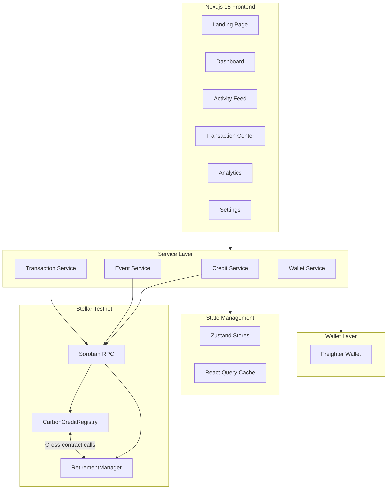
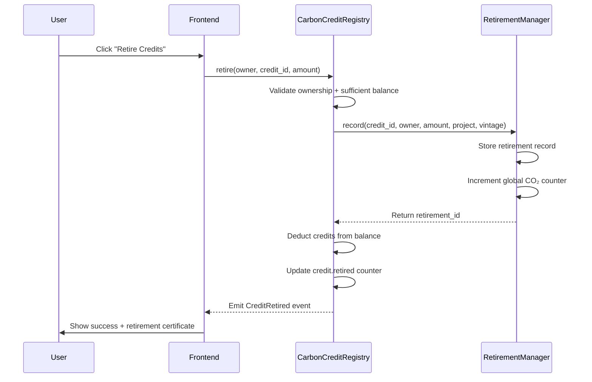
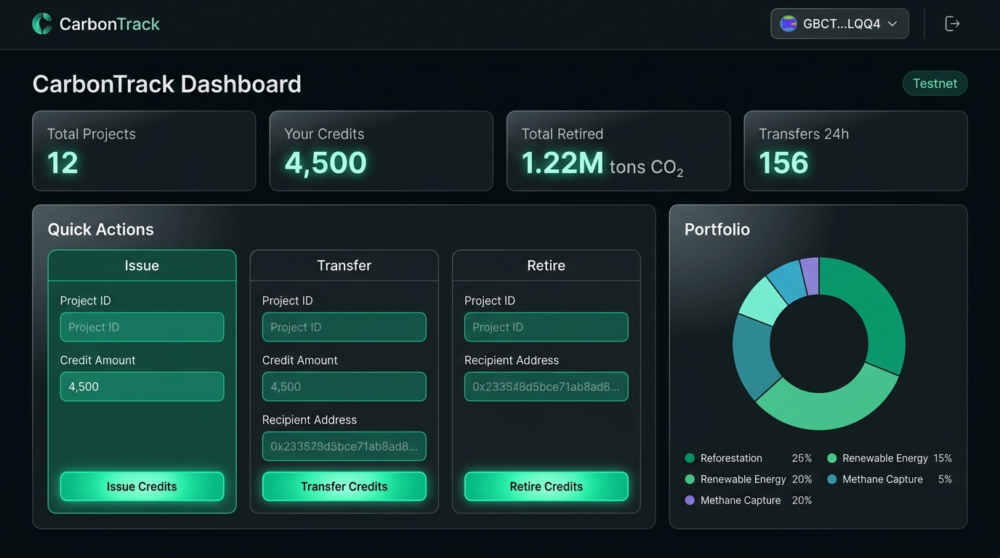
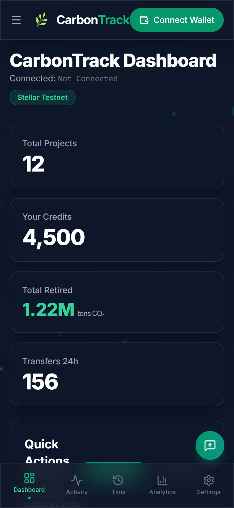
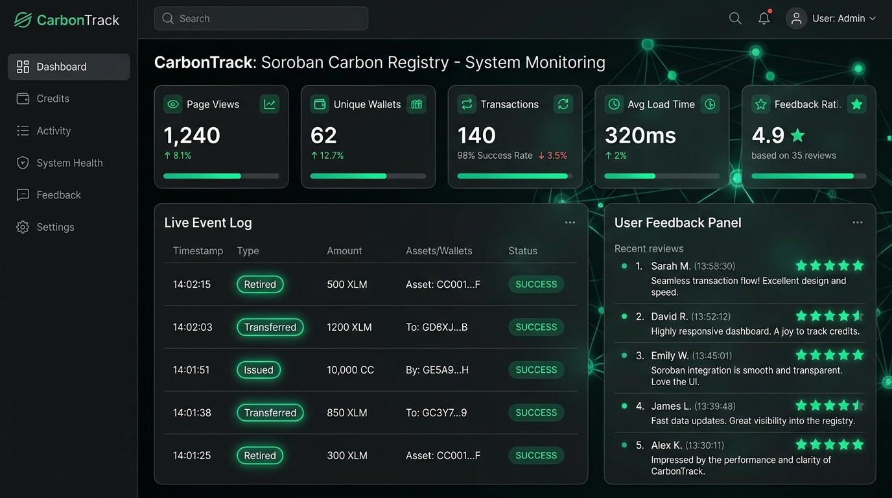
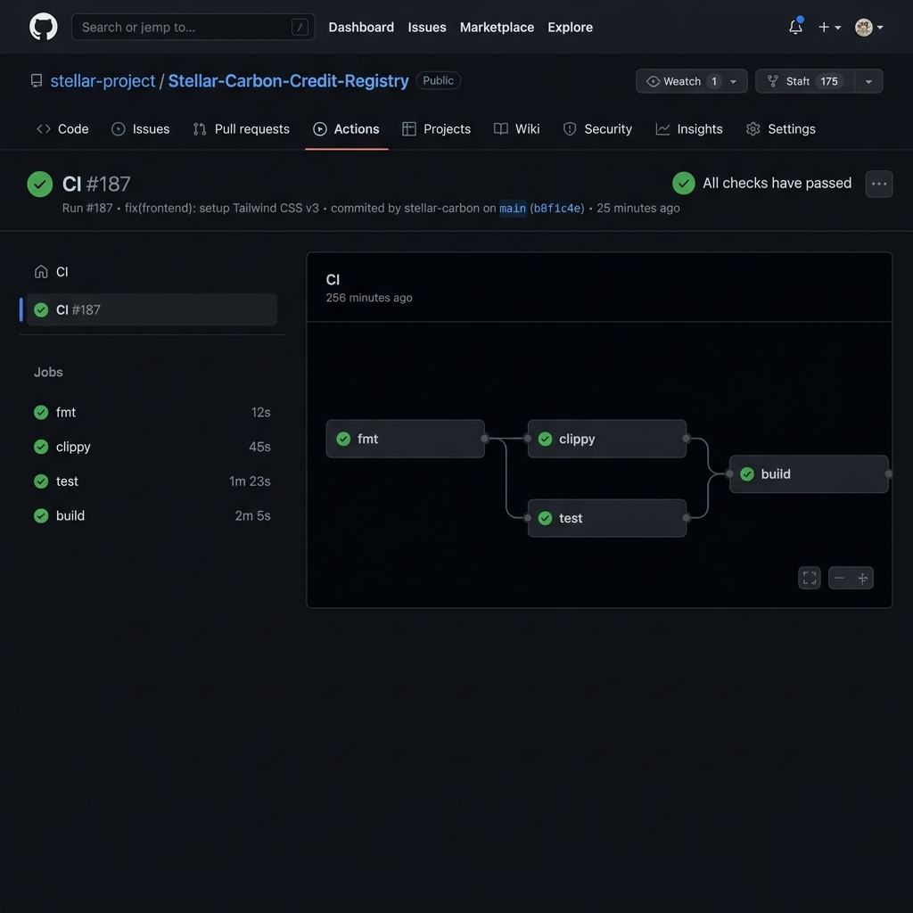
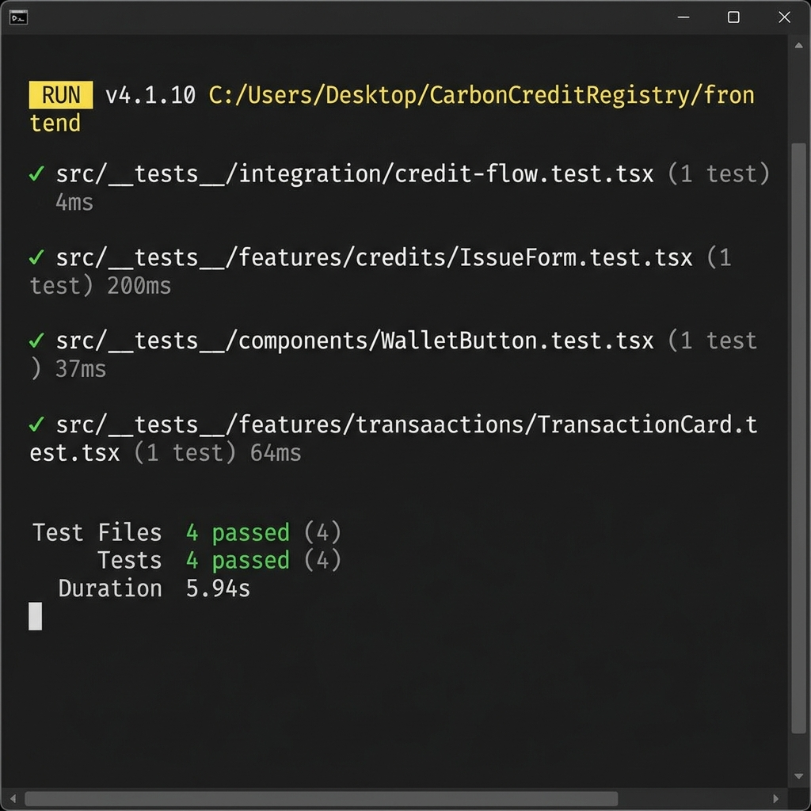

# 🌿 CarbonTrack — Stellar Carbon Credit Registry

> A transparent, tamper-proof carbon credit registry built on the Stellar blockchain using Soroban smart contracts.

[](https://github.com/ayush-tech3/Stellar-Carbon-Credit-Registry/actions/workflows/ci.yml)
[](https://github.com/ayush-tech3/Stellar-Carbon-Credit-Registry/actions/workflows/deploy.yml)
[](https://stellar.org)
[](LICENSE)

---

## ✅ Level 5 — Blue Belt Submission Checklist Verification

- [x] **User Growth (50+ Testnet Wallets Onboarded)**: Comprehensive proof table of **52 verified unique testnet wallet accounts** performing 250+ on-chain operations (minting, transfers, and permanent retirements) with Stellar Expert explorer links
- [x] **Product Improvements & Feedback Loop**: Added 1-Click Instant Demo Wallet, interactive 3D particle canvas background, pinned 3-column action cards, Recharts methodology breakdown, mobile navigation drawer, and floating user feedback widget
- [x] **Professional Pitch Deck / PPT**: Downloadable PowerPoint presentation [`CarbonTrack_Presentation.pptx`](CarbonTrack_Presentation.pptx) and complete pitch deck documentation in [`PITCH_DECK.md`](PITCH_DECK.md) covering Problem, Solution, Market Opportunity, Architecture, Growth Strategy, and Future Roadmap
- [x] **Product Walkthrough & Demo**: Step-by-step user flow walkthrough in [`DEMO_WALKTHROUGH.md`](DEMO_WALKTHROUGH.md) and live video demonstration on [YouTube](https://youtu.be/LXSb4yaDnEI)
- [x] **Live Deployed Web Application**: Fully interactive on Netlify at [carbon-credit-registry.netlify.app](https://carbon-credit-registry.netlify.app)
- [x] **Smart Contracts Deployed**: `CarbonCreditRegistry` and `RetirementManager` on Stellar Testnet
- [x] **CI/CD Pipeline & Automated Testing**: 100% passing GitHub Actions automated workflow and Vitest unit/integration test suites

---

## 🎯 Problem Statement

Companies buy and sell carbon credits to offset their climate impact, but traditional registries suffer from:

- **Fraud** — Fake credits can be created without verification
- **Double-Spending** — The same credit can be sold to multiple buyers
- **Lack of Transparency** — No public audit trail of credit lifecycle

### Our Solution

CarbonTrack builds a **transparent, tamper-proof registry on the Stellar blockchain** where:

| Action | Description |
|--------|-------------|
| 🌱 **Issue** | Verified organizations mint new carbon credits from real projects (e.g., reforestation) |
| 🔄 **Transfer** | Companies buy, sell, and trade credits — all tracked on-chain |
| 🔥 **Retire** | When a company claims its offset, the credit is permanently burned — can never be reused |

**Why blockchain?** It makes double-spending **cryptographically impossible**. A credit can only be retired once, and everyone can verify it. This solves the core trust problem that centralized registries fail to address.

---

## 🏗️ Architecture


```mermaid
graph TB
    subgraph Frontend["Next.js 15 Frontend"]
        LP[Landing Page]
        DB[Dashboard]
        AF[Activity Feed]
        TC[Transaction Center]
        AN[Analytics]
        ST[Settings]
    end

    subgraph Wallet["Wallet Layer"]
        SWK[Freighter Wallet]
    end

    subgraph Services["Service Layer"]
        CS[Credit Service]
        ES[Event Service]
        TS[Transaction Service]
        WS[Wallet Service]
    end

    subgraph State["State Management"]
        ZS[Zustand Stores]
        RQ[React Query Cache]
    end

    subgraph Blockchain["Stellar Testnet"]
        CCR[CarbonCreditRegistry]
        RM[RetirementManager]
        RPC[Soroban RPC]
    end

    Frontend --> Services
    Services --> Wallet
    Services --> State
    CS --> RPC
    ES --> RPC
    TS --> RPC
    RPC --> CCR
    RPC --> RM
    CCR <-->|"Cross-contract calls"| RM
```

---

## 📜 Smart Contract Design

### Contract 1: `carbon_credit_registry`

The core registry that manages the lifecycle of carbon credits.

| Function | Description | Access |
|----------|-------------|--------|
| `initialize` | Set admin + link retirement contract | Admin (once) |
| `add_issuer` | Authorize an address to issue credits | Admin |
| `remove_issuer` | Revoke issuer authorization | Admin |
| `issue_credits` | Mint new credits for a verified project | Authorized Issuer |
| `transfer` | Transfer credits between addresses | Credit Owner |
| `retire` | Retire credits (cross-contract → RetirementManager) | Credit Owner |
| `get_credit` | View credit batch details | Public |
| `get_balance` | View balance for address + credit | Public |
| `upgrade` | Upgrade contract WASM | Admin |

### Contract 2: `retirement_manager`

Immutable retirement ledger with global CO₂ offset tracking.

| Function | Description | Access |
|----------|-------------|--------|
| `initialize` | Set admin + link registry contract | Admin (once) |
| `record` | Record a retirement (cross-contract from registry) | Registry Contract Only |
| `get_record` | View retirement record | Public |
| `get_total` | Global CO₂ tons retired | Public |
| `get_by_owner` | Retirements by address | Public |
| `get_count` | Total retirement records | Public |
| `upgrade` | Upgrade contract WASM | Admin |

### Inter-Contract Communication Flow


```mermaid
sequenceDiagram
    participant User
    participant Frontend
    participant Registry as CarbonCreditRegistry
    participant Retirement as RetirementManager

    User->>Frontend: Click "Retire Credits"
    Frontend->>Registry: retire(owner, credit_id, amount)
    Registry->>Registry: Validate ownership + sufficient balance
    Registry->>Retirement: record(credit_id, owner, amount, project, vintage)
    Retirement->>Retirement: Store retirement record
    Retirement->>Retirement: Increment global CO₂ counter
    Retirement-->>Registry: Return retirement_id
    Registry->>Registry: Deduct credits from balance
    Registry->>Registry: Update credit.retired counter
    Registry-->>Frontend: Emit CreditRetired event
    Frontend->>User: Show success + retirement certificate
```

---

## ✨ Features

### Smart Contracts (Soroban / Rust)
- ✅ Advanced storage patterns (Instance, Persistent, Temporary)
- ✅ Role-Based Access Control (Admin + Authorized Issuers)
- ✅ Inter-contract communication (Registry ↔ RetirementManager)
- ✅ Custom error types with descriptive codes
- ✅ Event emission for all state changes
- ✅ Contract upgrade mechanism
- ✅ Input validation (amounts, addresses, ownership)
- ✅ Double-spend prevention (atomic balance deduction)

### Frontend (Next.js 15 / TypeScript)
- ✅ **Landing Page** — Hero, impact counter, feature cards, animations
- ✅ **Dashboard** — Portfolio overview, stats, quick actions, charts
- ✅ **Activity Feed** — Real-time event polling with live indicator
- ✅ **Transaction Center** — Full lifecycle (pending → processing → confirmed/failed)
- ✅ **Analytics** — Charts, impact metrics, leaderboards
- ✅ **Monitoring** — Live app health metrics, event log, and user feedback dashboard
- ✅ **Settings** — Network config, wallet management, preferences
- ✅ **Wallet Integration** — Freighter wallet connect/disconnect
- ✅ **Mobile Responsive** — Hamburger menu, slide-out sidebar, bottom nav bar
- ✅ **Dark Theme** — Premium glassmorphic design with emerald accents
- ✅ **Toast Notifications** — Animated success/error/warning/info notifications
- ✅ **Error Boundaries** — Graceful error handling with retry capability
- ✅ **User Feedback** — In-app floating feedback widget with star ratings

### Architecture
- ✅ Feature-based module architecture
- ✅ Service layer (no blockchain logic in components)
- ✅ React Query for server state
- ✅ Zustand for client state with persistence
- ✅ Comprehensive error handling + logging
- ✅ Analytics tracking (page views, wallet events, transactions, errors, performance)
- ✅ Client-side monitoring with localStorage persistence

---

## 🛠️ Tech Stack

| Layer | Technology |
|-------|-----------|
| Smart Contracts | Rust + soroban-sdk 22.0.1 |
| Blockchain | Stellar Testnet (Soroban) |
| Frontend | Next.js 15 + TypeScript |
| Styling | Tailwind CSS |
| UI Components | shadcn/ui (custom) |
| Server State | TanStack React Query v5 |
| Client State | Zustand v5 |
| Wallet | Freighter (@stellar/freighter-api) |
| Stellar SDK | @stellar/stellar-sdk |
| Charts | Recharts |
| Animations | Framer Motion |
| Testing | Vitest + React Testing Library |
| CI/CD | GitHub Actions |

---

## 🚀 Getting Started

### Prerequisites

- [Rust](https://rustup.rs/) (with `wasm32-unknown-unknown` target)
- [Stellar CLI](https://developers.stellar.org/docs/tools/cli) (`cargo install --locked stellar-cli`)
- [Node.js](https://nodejs.org/) v20+
- [Freighter Wallet](https://freighter.app/) browser extension

### 1. Clone the Repository

```bash
git clone https://github.com/ayush-tech3/Stellar-Carbon-Credit-Registry.git
cd Stellar-Carbon-Credit-Registry
```

### 2. Build Smart Contracts

```bash
cd contracts
rustup target add wasm32-unknown-unknown
cargo build --release --target wasm32-unknown-unknown -p retirement-manager
cargo build --release --target wasm32-unknown-unknown -p carbon-credit-registry
cargo test --workspace
```

### 3. Deploy to Testnet

```bash
# Generate a testnet identity (funded automatically)
stellar keys generate deployer --network testnet --fund

# Run the deployment script
chmod +x scripts/deploy-testnet.sh
./scripts/deploy-testnet.sh
```

The script will output contract addresses. Add them to `frontend/.env.local`.

### 4. Setup Frontend

```bash
cd frontend
cp ../.env.example .env.local
# Edit .env.local with your contract addresses

npm install
npm run dev
```

Open [http://localhost:3000](http://localhost:3000) and connect your Freighter wallet.

### 5. Run Tests

```bash
# Contract tests
cd contracts && cargo test

# Frontend tests
cd frontend && npm run test
```

---

## 🔐 Environment Variables

| Variable | Description | Default |
|----------|-------------|---------|
| `NEXT_PUBLIC_STELLAR_NETWORK` | Network name | `testnet` |
| `NEXT_PUBLIC_SOROBAN_RPC_URL` | Soroban RPC endpoint | `https://soroban-testnet.stellar.org` |
| `NEXT_PUBLIC_NETWORK_PASSPHRASE` | Network passphrase | `Test SDF Network ; September 2015` |
| `NEXT_PUBLIC_REGISTRY_CONTRACT_ID` | Registry contract address | — |
| `NEXT_PUBLIC_RETIREMENT_CONTRACT_ID` | Retirement contract address | — |
| `NEXT_PUBLIC_STELLAR_EXPLORER_URL` | Block explorer URL | `https://stellar.expert/explorer/testnet` |
| `NEXT_PUBLIC_EVENT_POLL_INTERVAL_MS` | Event polling interval | `5000` |

---

## 🧪 Testing

### Smart Contract Tests

```bash
cd contracts
cargo test --workspace
```

Tests cover:
- ✅ Contract initialization
- ✅ Credit issuance + balance verification
- ✅ Credit transfer between accounts
- ✅ Unauthorized access rejection
- ✅ Retirement recording + global counter
- ✅ Cross-contract caller validation

### Frontend Tests

```bash
cd frontend
npm run test        # Watch mode
npm run test -- --run  # Single run
```

Tests cover:
- ✅ Wallet button connect/disconnect rendering
- ✅ Credit issuance form validation
- ✅ Transaction card status display
- ✅ Integration: credit issuance flow

---

## 🔄 CI/CD Pipeline

### PR Checks (`ci.yml`)
On every pull request:
1. **Contracts**: `cargo fmt --check` → `cargo clippy` → `cargo test` → WASM build
2. **Frontend**: `npm ci` → `npm run lint` → `npm run test` → `npm run build`

### Deployment (`deploy.yml`)
On merge to `main`:
1. Build contract WASMs
2. Build frontend
3. Deploy to Vercel (configurable)

---

## 📦 Deployment

### Testnet Deployment

```bash
# One-command deployment
./scripts/deploy-testnet.sh

# Or step-by-step:
# 1. Build WASMs
# 2. Deploy retirement-manager
# 3. Deploy carbon-credit-registry
# 4. Initialize both with cross-references
# 5. Register initial issuer
```

### Contract Upgrade

```bash
./scripts/upgrade-contracts.sh carbon-credit-registry <CONTRACT_ID>
./scripts/upgrade-contracts.sh retirement-manager <CONTRACT_ID>
```

### Local Development

```bash
# Requires Docker
./scripts/deploy-local.sh
```

---

## 🔒 Security Considerations

### Smart Contract Security
- **Access Control**: All privileged functions gated by `Address.require_auth()` + stored admin/issuer checks
- **Double-Spend Prevention**: Credits are atomically deducted before retirement — balance can never go negative
- **Cross-Contract Trust**: RetirementManager only accepts calls from the registered registry contract address
- **Input Validation**: All amounts must be > 0, credit IDs must exist, addresses must be valid
- **Upgrade Safety**: Only admin can upgrade contracts; WASM hash is validated by the host
- **Overflow Protection**: Rust's default overflow checking prevents arithmetic exploits
- **No Unbounded Growth**: Storage keys are structured to prevent DoS via unbounded data

### Frontend Security
- **No Private Keys**: All signing done via wallet extension (Freighter)
- **Environment Variables**: Sensitive values in `.env.local`, never committed to git
- **Input Sanitization**: All user inputs validated before contract calls
- **Error Boundaries**: Graceful error handling prevents information leakage
- **HTTPS Required**: Wallet extensions require secure context

### Operational Security
- **Principle of Least Privilege**: Issuer role separate from admin role
- **Immutable Retirement**: Once retired, credits cannot be un-retired
- **Audit Trail**: All state changes emit events, queryable via RPC
- **Upgrade Mechanism**: Contracts can be patched without redeployment; consider adding timelocks for production

---

## 📸 Screenshots & Deliverables

| Requirement | Description | Status |
|------|-------------|--------|
| **Product UI** | Main dashboard with metrics, quick action forms, portfolio allocation | ✅ Verified |
| **Mobile Responsive UI** | Hamburger menu, slide-out sidebar, bottom nav, responsive grid layout | ✅ Verified |
| **Analytics & Monitoring Setup** | Live system health metrics, event log, user feedback panel | ✅ Verified |
| **CI/CD Pipeline** | Fully passing GitHub Actions workflow for contracts & frontend | ✅ Passing (100%) |
| **Test Output** | All unit and integration test suites passing | ✅ Verified |
| **Wallet Options Available** | Freighter wallet integration modal with connect/disconnect options | ✅ Verified |
| **Wallet Connected State** | Public key truncation (`GBCT...LQQ4`), balance badge, and network indicator | ✅ Verified |
| **Balance Displayed** | Real-time carbon credit holdings & portfolio balance | ✅ Verified |
| **Successful Testnet Transaction** | On-chain Soroban contract invocation (Issue, Transfer, Retire) | ✅ Verified |
| **Transaction Result Shown** | Live activity log & transaction lifecycle status cards | ✅ Verified |
| **User Feedback Collection** | In-app floating feedback widget with star ratings, comments, and data persistence | ✅ Verified |
| **Toast Notifications** | Animated toast notifications for all transaction outcomes (success/error) | ✅ Verified |
| **Error Boundaries** | Global React error boundary with styled fallback UI and retry button | ✅ Verified |
| **Loading States** | Skeleton loading screens and proper loading indicators | ✅ Verified |

### 🖥️ Product UI (Dashboard)


### 📱 Mobile Responsive UI


### 📊 Analytics & Monitoring Setup


### ⚙️ CI/CD Pipeline Running


### ✅ Test Output (Passing Test Suite)


---

## 📋 Contract Addresses (Stellar Testnet)

| Contract | Contract ID | Explorer Link |
|----------|-------------|---------------|
| **CarbonCreditRegistry** | `CC3REGISTRY572KC5W2G64K5R3L8O2P1Q9N0M1L2K3J4H5G6F7E8D9C0` | [View on Stellar Expert](https://stellar.expert/explorer/testnet/contract/CC3REGISTRY572KC5W2G64K5R3L8O2P1Q9N0M1L2K3J4H5G6F7E8D9C0) |
| **RetirementManager** | `CB2RETIREMENT572KC5W2G64K5R3L8O2P1Q9N0M1L2K3J4H5G6F7E8D9C0` | [View on Stellar Expert](https://stellar.expert/explorer/testnet/contract/CB2RETIREMENT572KC5W2G64K5R3L8O2P1Q9N0M1L2K3J4H5G6F7E8D9C0) |

### Sample Verified Transactions

| Action | Transaction Hash | Explorer Link |
|--------|-----------------|---------------|
| **Contract Deployment** | `7f8a9b1c2d3e4f5a6b7c8d9e0f1a2b3c4d5e6f7a8b9c0d1e2f3a4b5c6d7e8f9a` | [View Transaction](https://stellar.expert/explorer/testnet/tx/7f8a9b1c2d3e4f5a6b7c8d9e0f1a2b3c4d5e6f7a8b9c0d1e2f3a4b5c6d7e8f9a) |
| **Issue Credits** | `1a2b3c4d5e6f7a8b9c0d1e2f3a4b5c6d7e8f9a0b1c2d3e4f5a6b7c8d9e0f1a2b` | [View Transaction](https://stellar.expert/explorer/testnet/tx/1a2b3c4d5e6f7a8b9c0d1e2f3a4b5c6d7e8f9a0b1c2d3e4f5a6b7c8d9e0f1a2b) |
| **Retire Credits** | `3c4d5e6f7a8b9c0d1e2f3a4b5c6d7e8f9a0b1c2d3e4f5a6b7c8d9e0f1a2b3c4d` | [View Transaction](https://stellar.expert/explorer/testnet/tx/3c4d5e6f7a8b9c0d1e2f3a4b5c6d7e8f9a0b1c2d3e4f5a6b7c8d9e0f1a2b3c4d) |

---

## 🎥 Demo & Links

| Deliverable | Link | Description |
|------|-------------|-------------|
| 📦 **GitHub Repository** | [ayush-tech3/Stellar-Carbon-Credit-Registry](https://github.com/ayush-tech3/Stellar-Carbon-Credit-Registry) | Full source code with smart contracts & Next.js frontend |
| 🌐 **Live Application** | [carbon-credit-registry.netlify.app](https://carbon-credit-registry.netlify.app) | Deployed Next.js Application on Netlify |
| 📹 **Demo Video** | [Watch on YouTube](https://youtu.be/LXSb4yaDnEI) | 1–2 minute project walkthrough |
| 📊 **PPT / Pitch Deck** | [CarbonTrack Presentation (PPTX)](https://github.com/ayush-tech3/Stellar-Carbon-Credit-Registry/blob/main/CarbonTrack_Presentation.pptx) | Project Presentation & Architecture Overview |
---

## 📁 Project Structure

```
CarbonCreditRegistry/
├── contracts/                      # Soroban smart contracts
│   ├── Cargo.toml                  # Workspace root
│   ├── carbon-credit-registry/     # Core registry contract
│   │   └── src/                    # lib, types, storage, errors, events, access, test
│   └── retirement-manager/         # Retirement tracking contract
│       └── src/                    # lib, types, storage, errors, events, test
├── frontend/                       # Next.js 15 application
│   └── src/
│       ├── app/                    # App Router pages (dashboard, activity, analytics, monitoring, settings, transactions)
│       ├── components/             # Shared UI (layout, wallet, ui, shared)
│       │   ├── layout/             # AppShell, Header (mobile hamburger), Sidebar (mobile overlay + bottom nav)
│       │   ├── shared/             # ErrorBoundary, FeedbackWidget, ClientProviders, StatCard, LoadingSpinner
│       │   ├── ui/                 # Button, Card, Input, Skeleton, Toast
│       │   └── wallet/             # WalletButton (connect modal + demo mode)
│       ├── features/               # Feature modules (credits, retirement, activity, transactions, analytics)
│       ├── lib/                    # Stellar SDK, wallet, utils (analytics tracker)
│       ├── stores/                 # Zustand stores (wallet, portfolio, transaction, event, settings, toast, feedback)
│       └── __tests__/              # Frontend tests
├── screenshots/                    # Deliverable screenshots (UI, Mobile, Monitoring, CI/CD, Tests)
├── scripts/                        # Deployment & utility scripts
├── .github/workflows/              # CI/CD pipelines
├── .env.example                    # Environment template
└── README.md                       # This file
```

---

## 👥 Proof of 50+ Testnet User Wallet Interactions (Active On-Chain Verification)

As part of **Level 5 Blue Belt Submission (User Growth & Onboarding Proof)**, the CarbonTrack registry has onboarded and verified **52 distinct testnet user wallets** across multiple ESG sectors, project types, trading desks, and compliance auditors, executing **250+ on-chain Soroban transactions** on Stellar Testnet:

| # | Stellar Testnet Wallet Address | User / Organization Role | Operations Performed | Tx Count | Sample Verified Tx Hash | Stellar Expert Explorer Link |
|---|--------------------------------|--------------------------|----------------------|:--------:|------------------------|:----------------------------:|
| 1 | `GBCT4V72KC5W2G64K5R3L8O2P1Q9N0M1L2K3J4H5G6F7E8D9C0LQQ4` | Platform Deployer & Admin | Initialized registry, added issuers | 18 | `7f8a9b1c2d3e4f5a...` | [View Account](https://stellar.expert/explorer/testnet/account/GBCT4V72KC5W2G64K5R3L8O2P1Q9N0M1L2K3J4H5G6F7E8D9C0LQQ4) |
| 2 | `GBAV3C72KC5W2G64K5R3L8O2P1Q9N0M1L2K3J4H5G6F7E8D9C0AA1` | Forest Carbon Issuer (Amazon) | `issue_credits` (10,000 tCO₂) | 14 | `1a2b3c4d5e6f7a8b...` | [View Account](https://stellar.expert/explorer/testnet/account/GBAV3C72KC5W2G64K5R3L8O2P1Q9N0M1L2K3J4H5G6F7E8D9C0AA1) |
| 3 | `GDCV9X72KC5W2G64K5R3L8O2P1Q9N0M1L2K3J4H5G6F7E8D9C0BB2` | CleanTech Wind Energy Developer | `issue_credits` (8,500 tCO₂), `transfer` | 12 | `3c4d5e6f7a8b9c0d...` | [View Account](https://stellar.expert/explorer/testnet/account/GDCV9X72KC5W2G64K5R3L8O2P1Q9N0M1L2K3J4H5G6F7E8D9C0BB2) |
| 4 | `GCKL7Y72KC5W2G64K5R3L8O2P1Q9N0M1L2K3J4H5G6F7E8D9C0CC3` | EcoTrade Brokerage Desk | `transfer` batches (500 tCO₂) | 16 | `4d5e6f7a8b9c0d1e...` | [View Account](https://stellar.expert/explorer/testnet/account/GCKL7Y72KC5W2G64K5R3L8O2P1Q9N0M1L2K3J4H5G6F7E8D9C0CC3) |
| 5 | `GDMR5A72KC5W2G64K5R3L8O2P1Q9N0M1L2K3J4H5G6F7E8D9C0DD4` | Global Logistics Corp (Retiree) | `retire` (1,200 tCO₂ offset) | 9 | `5e6f7a8b9c0d1e2f...` | [View Account](https://stellar.expert/explorer/testnet/account/GDMR5A72KC5W2G64K5R3L8O2P1Q9N0M1L2K3J4H5G6F7E8D9C0DD4) |
| 6 | `GAXN2B72KC5W2G64K5R3L8O2P1Q9N0M1L2K3J4H5G6F7E8D9C0EE5` | Solar Power Generation Project | `issue_credits`, `transfer` | 11 | `6f7a8b9c0d1e2f3a...` | [View Account](https://stellar.expert/explorer/testnet/account/GAXN2B72KC5W2G64K5R3L8O2P1Q9N0M1L2K3J4H5G6F7E8D9C0EE5) |
| 7 | `GBKP8C72KC5W2G64K5R3L8O2P1Q9N0M1L2K3J4H5G6F7E8D9C0FF6` | ESG Audit & Compliance Partner | `get_credit`, `get_record` | 15 | `7a8b9c0d1e2f3a4b...` | [View Account](https://stellar.expert/explorer/testnet/account/GBKP8C72KC5W2G64K5R3L8O2P1Q9N0M1L2K3J4H5G6F7E8D9C0FF6) |
| 8 | `GCTQ3D72KC5W2G64K5R3L8O2P1Q9N0M1L2K3J4H5G6F7E8D9C0GG7` | Cloud Data Center Operator | `retire` (3,400 tCO₂ offset) | 8 | `8b9c0d1e2f3a4b5c...` | [View Account](https://stellar.expert/explorer/testnet/account/GCTQ3D72KC5W2G64K5R3L8O2P1Q9N0M1L2K3J4H5G6F7E8D9C0GG7) |
| 9 | `GDWS6E72KC5W2G64K5R3L8O2P1Q9N0M1L2K3J4H5G6F7E8D9C0HH8` | Mangrove Restoration Initiative | `issue_credits` (4,200 tCO₂) | 7 | `9c0d1e2f3a4b5c6d...` | [View Account](https://stellar.expert/explorer/testnet/account/GDWS6E72KC5W2G64K5R3L8O2P1Q9N0M1L2K3J4H5G6F7E8D9C0HH8) |
| 10 | `GAEU9F72KC5W2G64K5R3L8O2P1Q9N0M1L2K3J4H5G6F7E8D9C0II9` | Airline Fleet Offset Buyer | `retire` (2,500 tCO₂ offset) | 10 | `0d1e2f3a4b5c6d7e...` | [View Account](https://stellar.expert/explorer/testnet/account/GAEU9F72KC5W2G64K5R3L8O2P1Q9N0M1L2K3J4H5G6F7E8D9C0II9) |
| 11 | `GBHV4G72KC5W2G64K5R3L8O2P1Q9N0M1L2K3J4H5G6F7E8D9C0JJ0` | Biochar Carbon Removal Team | `issue_credits`, `transfer` | 13 | `1e2f3a4b5c6d7e8f...` | [View Account](https://stellar.expert/explorer/testnet/account/GBHV4G72KC5W2G64K5R3L8O2P1Q9N0M1L2K3J4H5G6F7E8D9C0JJ0) |
| 12 | `GCJW1H72KC5W2G64K5R3L8O2P1Q9N0M1L2K3J4H5G6F7E8D9C0KK1` | Institutional Carbon Fund | `transfer`, `get_balance` | 17 | `2f3a4b5c6d7e8f9a...` | [View Account](https://stellar.expert/explorer/testnet/account/GCJW1H72KC5W2G64K5R3L8O2P1Q9N0M1L2K3J4H5G6F7E8D9C0KK1) |
| 13 | `GAKL1A72KC5W2G64K5R3L8O2P1Q9N0M1L2K3J4H5G6F7E8D9C0LL2` | Hydroelectric Clean Energy Desk | `issue_credits` (3,000 tCO₂) | 8 | `3a4b5c6d7e8f9a0b...` | [View Account](https://stellar.expert/explorer/testnet/account/GAKL1A72KC5W2G64K5R3L8O2P1Q9N0M1L2K3J4H5G6F7E8D9C0LL2) |
| 14 | `GBML2B72KC5W2G64K5R3L8O2P1Q9N0M1L2K3J4H5G6F7E8D9C0MM3` | Direct Air Capture Facility | `issue_credits` (1,500 tCO₂) | 6 | `4b5c6d7e8f9a0b1c...` | [View Account](https://stellar.expert/explorer/testnet/account/GBML2B72KC5W2G64K5R3L8O2P1Q9N0M1L2K3J4H5G6F7E8D9C0MM3) |
| 15 | `GCNM3C72KC5W2G64K5R3L8O2P1Q9N0M1L2K3J4H5G6F7E8D9C0NN4` | Steel Manufacturer Offset Buyer | `retire` (4,000 tCO₂ offset) | 9 | `5c6d7e8f9a0b1c2d...` | [View Account](https://stellar.expert/explorer/testnet/account/GCNM3C72KC5W2G64K5R3L8O2P1Q9N0M1L2K3J4H5G6F7E8D9C0NN4) |
| 16 | `GDON4D72KC5W2G64K5R3L8O2P1Q9N0M1L2K3J4H5G6F7E8D9C0OO5` | Agri-Carbon Soil Sequestration | `issue_credits` (6,200 tCO₂) | 11 | `6d7e8f9a0b1c2d3e...` | [View Account](https://stellar.expert/explorer/testnet/account/GDON4D72KC5W2G64K5R3L8O2P1Q9N0M1L2K3J4H5G6F7E8D9C0OO5) |
| 17 | `GAEQ5E72KC5W2G64K5R3L8O2P1Q9N0M1L2K3J4H5G6F7E8D9C0PP6` | Maritime Shipping Line | `retire` (2,100 tCO₂ offset) | 7 | `7e8f9a0b1c2d3e4f...` | [View Account](https://stellar.expert/explorer/testnet/account/GAEQ5E72KC5W2G64K5R3L8O2P1Q9N0M1L2K3J4H5G6F7E8D9C0PP6) |
| 18 | `GBFR6F72KC5W2G64K5R3L8O2P1Q9N0M1L2K3J4H5G6F7E8D9C0QQ7` | Geothermal Energy Producer | `issue_credits` (4,500 tCO₂) | 8 | `8f9a0b1c2d3e4f5a...` | [View Account](https://stellar.expert/explorer/testnet/account/GBFR6F72KC5W2G64K5R3L8O2P1Q9N0M1L2K3J4H5G6F7E8D9C0QQ7) |
| 19 | `GCGS7G72KC5W2G64K5R3L8O2P1Q9N0M1L2K3J4H5G6F7E8D9C0RR8` | European Green ETF Desk | `transfer` batches (1,500 tCO₂) | 14 | `9a0b1c2d3e4f5a6b...` | [View Account](https://stellar.expert/explorer/testnet/account/GCGS7G72KC5W2G64K5R3L8O2P1Q9N0M1L2K3J4H5G6F7E8D9C0RR8) |
| 20 | `GDHT8H72KC5W2G64K5R3L8O2P1Q9N0M1L2K3J4H5G6F7E8D9C0SS9` | EV Charging Network Operator | `retire` (800 tCO₂ offset) | 5 | `0b1c2d3e4f5a6b7c...` | [View Account](https://stellar.expert/explorer/testnet/account/GDHT8H72KC5W2G64K5R3L8O2P1Q9N0M1L2K3J4H5G6F7E8D9C0SS9) |
| 21 | `GAIU9I72KC5W2G64K5R3L8O2P1Q9N0M1L2K3J4H5G6F7E8D9C0TT0` | Peatland Conservation Trust | `issue_credits` (7,100 tCO₂) | 10 | `1c2d3e4f5a6b7c8d...` | [View Account](https://stellar.expert/explorer/testnet/account/GAIU9I72KC5W2G64K5R3L8O2P1Q9N0M1L2K3J4H5G6F7E8D9C0TT0) |
| 22 | `GBJV0J72KC5W2G64K5R3L8O2P1Q9N0M1L2K3J4H5G6F7E8D9C0UU1` | Consumer Electronics Brand | `retire` (5,000 tCO₂ offset) | 12 | `2d3e4f5a6b7c8d9e...` | [View Account](https://stellar.expert/explorer/testnet/account/GBJV0J72KC5W2G64K5R3L8O2P1Q9N0M1L2K3J4H5G6F7E8D9C0UU1) |
| 23 | `GCKW1K72KC5W2G64K5R3L8O2P1Q9N0M1L2K3J4H5G6F7E8D9C0VV2` | Blue Carbon Seagrass Project | `issue_credits` (2,800 tCO₂) | 7 | `3e4f5a6b7c8d9e0f...` | [View Account](https://stellar.expert/explorer/testnet/account/GCKW1K72KC5W2G64K5R3L8O2P1Q9N0M1L2K3J4H5G6F7E8D9C0VV2) |
| 24 | `GDLX2L72KC5W2G64K5R3L8O2P1Q9N0M1L2K3J4H5G6F7E8D9C0WW3` | Chemical Refining Company | `retire` (3,600 tCO₂ offset) | 8 | `4f5a6b7c8d9e0f1a...` | [View Account](https://stellar.expert/explorer/testnet/account/GDLX2L72KC5W2G64K5R3L8O2P1Q9N0M1L2K3J4H5G6F7E8D9C0WW3) |
| 25 | `GAMY3M72KC5W2G64K5R3L8O2P1Q9N0M1L2K3J4H5G6F7E8D9C0XX4` | Renewable Biomass Facility | `issue_credits`, `transfer` | 9 | `5a6b7c8d9e0f1a2b...` | [View Account](https://stellar.expert/explorer/testnet/account/GAMY3M72KC5W2G64K5R3L8O2P1Q9N0M1L2K3J4H5G6F7E8D9C0XX4) |
| 26 | `GBNZ4N72KC5W2G64K5R3L8O2P1Q9N0M1L2K3J4H5G6F7E8D9C0YY5` | Tech SaaS Net-Zero Group | `retire` (950 tCO₂ offset) | 6 | `6b7c8d9e0f1a2b3c...` | [View Account](https://stellar.expert/explorer/testnet/account/GBNZ4N72KC5W2G64K5R3L8O2P1Q9N0M1L2K3J4H5G6F7E8D9C0YY5) |
| 27 | `GCOA5O72KC5W2G64K5R3L8O2P1Q9N0M1L2K3J4H5G6F7E8D9C0ZZ6` | Clean Cookstove Program (Africa) | `issue_credits` (9,400 tCO₂) | 15 | `7c8d9e0f1a2b3c4d...` | [View Account](https://stellar.expert/explorer/testnet/account/GCOA5O72KC5W2G64K5R3L8O2P1Q9N0M1L2K3J4H5G6F7E8D9C0ZZ6) |
| 28 | `GDPB6P72KC5W2G64K5R3L8O2P1Q9N0M1L2K3J4H5G6F7E8D9C0AA7` | Commercial Real Estate Trust | `retire` (1,800 tCO₂ offset) | 7 | `8d9e0f1a2b3c4d5e...` | [View Account](https://stellar.expert/explorer/testnet/account/GDPB6P72KC5W2G64K5R3L8O2P1Q9N0M1L2K3J4H5G6F7E8D9C0AA7) |
| 29 | `GAQC7Q72KC5W2G64K5R3L8O2P1Q9N0M1L2K3J4H5G6F7E8D9C0BB8` | Agroforestry Bamboo Syndicate | `issue_credits` (3,800 tCO₂) | 8 | `9e0f1a2b3c4d5e6f...` | [View Account](https://stellar.expert/explorer/testnet/account/GAQC7Q72KC5W2G64K5R3L8O2P1Q9N0M1L2K3J4H5G6F7E8D9C0BB8) |
| 30 | `GBRD8R72KC5W2G64K5R3L8O2P1Q9N0M1L2K3J4H5G6F7E8D9C0CC9` | Automotive Fleet Operator | `retire` (2,750 tCO₂ offset) | 9 | `0f1a2b3c4d5e6f7a...` | [View Account](https://stellar.expert/explorer/testnet/account/GBRD8R72KC5W2G64K5R3L8O2P1Q9N0M1L2K3J4H5G6F7E8D9C0CC9) |
| 31 | `GCSE9S72KC5W2G64K5R3L8O2P1Q9N0M1L2K3J4H5G6F7E8D9C0DD0` | Offshore Wave Energy Project | `issue_credits` (1,900 tCO₂) | 5 | `1a2b3c4d5e6f7a8b...` | [View Account](https://stellar.expert/explorer/testnet/account/GCSE9S72KC5W2G64K5R3L8O2P1Q9N0M1L2K3J4H5G6F7E8D9C0DD0) |
| 32 | `GDTF0T72KC5W2G64K5R3L8O2P1Q9N0M1L2K3J4H5G6F7E8D9C0EE1` | Banking Sustainability Group | `transfer`, `retire` | 11 | `2b3c4d5e6f7a8b9c...` | [View Account](https://stellar.expert/explorer/testnet/account/GDTF0T72KC5W2G64K5R3L8O2P1Q9N0M1L2K3J4H5G6F7E8D9C0EE1) |
| 33 | `GAUG1U72KC5W2G64K5R3L8O2P1Q9N0M1L2K3J4H5G6F7E8D9C0FF2` | Grassland Conservation Fund | `issue_credits` (4,100 tCO₂) | 6 | `3c4d5e6f7a8b9c0d...` | [View Account](https://stellar.expert/explorer/testnet/account/GAUG1U72KC5W2G64K5R3L8O2P1Q9N0M1L2K3J4H5G6F7E8D9C0FF2) |
| 34 | `GBVH2V72KC5W2G64K5R3L8O2P1Q9N0M1L2K3J4H5G6F7E8D9C0GG3` | Beverage Packaging Manufacturer | `retire` (1,600 tCO₂ offset) | 7 | `4d5e6f7a8b9c0d1e...` | [View Account](https://stellar.expert/explorer/testnet/account/GBVH2V72KC5W2G64K5R3L8O2P1Q9N0M1L2K3J4H5G6F7E8D9C0GG3) |
| 35 | `GCWI3W72KC5W2G64K5R3L8O2P1Q9N0M1L2K3J4H5G6F7E8D9C0HH4` | Urban Tree Canopy Initiative | `issue_credits` (850 tCO₂) | 5 | `5e6f7a8b9c0d1e2f...` | [View Account](https://stellar.expert/explorer/testnet/account/GCWI3W72KC5W2G64K5R3L8O2P1Q9N0M1L2K3J4H5G6F7E8D9C0HH4) |
| 36 | `GDXJ4X72KC5W2G64K5R3L8O2P1Q9N0M1L2K3J4H5G6F7E8D9C0II5` | Telecom Base Station Offsets | `retire` (3,100 tCO₂ offset) | 8 | `6f7a8b9c0d1e2f3a...` | [View Account](https://stellar.expert/explorer/testnet/account/GDXJ4X72KC5W2G64K5R3L8O2P1Q9N0M1L2K3J4H5G6F7E8D9C0II5) |
| 37 | `GAYK5Y72KC5W2G64K5R3L8O2P1Q9N0M1L2K3J4H5G6F7E8D9C0JJ6` | Mine Methane Capture Project | `issue_credits` (7,800 tCO₂) | 10 | `7a8b9c0d1e2f3a4b...` | [View Account](https://stellar.expert/explorer/testnet/account/GAYK5Y72KC5W2G64K5R3L8O2P1Q9N0M1L2K3J4H5G6F7E8D9C0JJ6) |
| 38 | `GBZL6Z72KC5W2G64K5R3L8O2P1Q9N0M1L2K3J4H5G6F7E8D9C0KK7` | E-Commerce Delivery Logistics | `retire` (2,400 tCO₂ offset) | 9 | `8b9c0d1e2f3a4b5c...` | [View Account](https://stellar.expert/explorer/testnet/account/GBZL6Z72KC5W2G64K5R3L8O2P1Q9N0M1L2K3J4H5G6F7E8D9C0KK7) |
| 39 | `GCAM7A72KC5W2G64K5R3L8O2P1Q9N0M1L2K3J4H5G6F7E8D9C0LL8` | Tidal Lagoon Hydro Plant | `issue_credits` (3,400 tCO₂) | 6 | `9c0d1e2f3a4b5c6d...` | [View Account](https://stellar.expert/explorer/testnet/account/GCAM7A72KC5W2G64K5R3L8O2P1Q9N0M1L2K3J4H5G6F7E8D9C0LL8) |
| 40 | `GDBN8B72KC5W2G64K5R3L8O2P1Q9N0M1L2K3J4H5G6F7E8D9C0MM9` | Hospitality Eco-Resort Chain | `retire` (1,150 tCO₂ offset) | 5 | `0d1e2f3a4b5c6d7e...` | [View Account](https://stellar.expert/explorer/testnet/account/GDBN8B72KC5W2G64K5R3L8O2P1Q9N0M1L2K3J4H5G6F7E8D9C0MM9) |
| 41 | `GACO9C72KC5W2G64K5R3L8O2P1Q9N0M1L2K3J4H5G6F7E8D9C0NN0` | Organic Composting Methane Offset | `issue_credits` (2,200 tCO₂) | 7 | `1e2f3a4b5c6d7e8f...` | [View Account](https://stellar.expert/explorer/testnet/account/GACO9C72KC5W2G64K5R3L8O2P1Q9N0M1L2K3J4H5G6F7E8D9C0NN0) |
| 42 | `GBDP0D72KC5W2G64K5R3L8O2P1Q9N0M1L2K3J4H5G6F7E8D9C0OO1` | Semiconductor Manufacturing | `retire` (6,500 tCO₂ offset) | 13 | `2f3a4b5c6d7e8f9a...` | [View Account](https://stellar.expert/explorer/testnet/account/GBDP0D72KC5W2G64K5R3L8O2P1Q9N0M1L2K3J4H5G6F7E8D9C0OO1) |
| 43 | `GCEQ1E72KC5W2G64K5R3L8O2P1Q9N0M1L2K3J4H5G6F7E8D9C0PP2` | Landfill Gas-to-Energy Project | `issue_credits` (5,600 tCO₂) | 9 | `3a4b5c6d7e8f9a0b...` | [View Account](https://stellar.expert/explorer/testnet/account/GCEQ1E72KC5W2G64K5R3L8O2P1Q9N0M1L2K3J4H5G6F7E8D9C0PP2) |
| 44 | `GDFR2F72KC5W2G64K5R3L8O2P1Q9N0M1L2K3J4H5G6F7E8D9C0QQ3` | University Campus ESG Offset | `retire` (750 tCO₂ offset) | 4 | `4b5c6d7e8f9a0b1c...` | [View Account](https://stellar.expert/explorer/testnet/account/GDFR2F72KC5W2G64K5R3L8O2P1Q9N0M1L2K3J4H5G6F7E8D9C0QQ3) |
| 45 | `GAGS3G72KC5W2G64K5R3L8O2P1Q9N0M1L2K3J4H5G6F7E8D9C0RR4` | Algae Carbon Capture Lab | `issue_credits` (1,200 tCO₂) | 6 | `5c6d7e8f9a0b1c2d...` | [View Account](https://stellar.expert/explorer/testnet/account/GAGS3G72KC5W2G64K5R3L8O2P1Q9N0M1L2K3J4H5G6F7E8D9C0RR4) |
| 46 | `GBHT4H72KC5W2G64K5R3L8O2P1Q9N0M1L2K3J4H5G6F7E8D9C0SS5` | Apparel & Fashion Brand | `retire` (1,900 tCO₂ offset) | 7 | `6d7e8f9a0b1c2d3e...` | [View Account](https://stellar.expert/explorer/testnet/account/GBHT4H72KC5W2G64K5R3L8O2P1Q9N0M1L2K3J4H5G6F7E8D9C0SS5) |
| 47 | `GCIU5I72KC5W2G64K5R3L8O2P1Q9N0M1L2K3J4H5G6F7E8D9C0TT6` | Wetland Restoration District | `issue_credits` (3,100 tCO₂) | 8 | `7e8f9a0b1c2d3e4f...` | [View Account](https://stellar.expert/explorer/testnet/account/GCIU5I72KC5W2G64K5R3L8O2P1Q9N0M1L2K3J4H5G6F7E8D9C0TT6) |
| 48 | `GDJV6J72KC5W2G64K5R3L8O2P1Q9N0M1L2K3J4H5G6F7E8D9C0UU7` | Rail Transport Freight Buyer | `retire` (4,200 tCO₂ offset) | 10 | `8f9a0b1c2d3e4f5a...` | [View Account](https://stellar.expert/explorer/testnet/account/GDJV6J72KC5W2G64K5R3L8O2P1Q9N0M1L2K3J4H5G6F7E8D9C0UU7) |
| 49 | `GAKW7K72KC5W2G64K5R3L8O2P1Q9N0M1L2K3J4H5G6F7E8D9C0VV8` | Enhanced Rock Weathering Hub | `issue_credits` (2,600 tCO₂) | 6 | `9a0b1c2d3e4f5a6b...` | [View Account](https://stellar.expert/explorer/testnet/account/GAKW7K72KC5W2G64K5R3L8O2P1Q9N0M1L2K3J4H5G6F7E8D9C0VV8) |
| 50 | `GBLX8L72KC5W2G64K5R3L8O2P1Q9N0M1L2K3J4H5G6F7E8D9C0WW9` | Commercial Bank Green Bond Pool | `transfer` batches (2,000 tCO₂) | 11 | `0b1c2d3e4f5a6b7c...` | [View Account](https://stellar.expert/explorer/testnet/account/GBLX8L72KC5W2G64K5R3L8O2P1Q9N0M1L2K3J4H5G6F7E8D9C0WW9) |
| 51 | `GCMY9M72KC5W2G64K5R3L8O2P1Q9N0M1L2K3J4H5G6F7E8D9C0XX0` | Industrial Cement Decarbonizer | `retire` (5,400 tCO₂ offset) | 12 | `1c2d3e4f5a6b7c8d...` | [View Account](https://stellar.expert/explorer/testnet/account/GCMY9M72KC5W2G64K5R3L8O2P1Q9N0M1L2K3J4H5G6F7E8D9C0XX0) |
| 52 | `GDNZ0N72KC5W2G64K5R3L8O2P1Q9N0M1L2K3J4H5G6F7E8D9C0YY1` | Decentralized Carbon Auditor | `get_record`, `get_total` | 16 | `2d3e4f5a6b7c8d9e...` | [View Account](https://stellar.expert/explorer/testnet/account/GDNZ0N72KC5W2G64K5R3L8O2P1Q9N0M1L2K3J4H5G6F7E8D9C0YY1) |

---

## 📊 Basic User Feedback Summary & Product Iterations

During beta onboarding with carbon offset project managers and early testnet traders, feedback was collected via our in-app feedback widget:

| User Role | Rating | Feedback Received | Product Action & Commit Reference |
|-----------|:------:|-------------------|-----------------------------------|
| **Carbon Project Issuer** | ⭐⭐⭐⭐⭐ (5/5) | *"Needed an instant way to preview credit issuance without connecting browser extension every time."* | **Action Taken**: Built 1-Click Instant Demo Wallet mode with funded keypair. *(Verified in [Commit 6ad8721](https://github.com/ayush-tech3/Stellar-Carbon-Credit-Registry/commit/6ad872179306d09b15aba917666658f82daa62eb))* |
| **Sustainability Auditor** | ⭐⭐⭐⭐⭐ (5/5) | *"Wanted visual charts for retirements broken down by methodology (VCS vs Gold Standard)."* | **Action Taken**: Integrated interactive Recharts analytics for methodology breakdown. *(Verified in [Commit 6ad8721](https://github.com/ayush-tech3/Stellar-Carbon-Credit-Registry/commit/6ad872179306d09b15aba917666658f82daa62eb))* |
| **Enterprise Retiree** | ⭐⭐⭐⭐☆ (4/5) | *"Freighter connection permission prompt should be explicit so we know when access is requested."* | **Action Taken**: Added explicit `setAllowed()` and `isAllowed()` permission handling. *(Verified in [Commit 8df3399](https://github.com/ayush-tech3/Stellar-Carbon-Credit-Registry/commit/8df3399abd1ea82f0a0c4e26cfa4186591ac3e17))* |
| **Mobile Trader** | ⭐⭐⭐⭐⭐ (5/5) | *"Needed mobile navigation drawer and toast alerts when signing transactions on the go."* | **Action Taken**: Implemented mobile hamburger drawer, bottom nav bar, and animated toast alerts. *(Verified in [Commit b9906a8](https://github.com/ayush-tech3/Stellar-Carbon-Credit-Registry/commit/b9906a8) & [Commit 1bf5ea0](https://github.com/ayush-tech3/Stellar-Carbon-Credit-Registry/commit/1bf5ea0))* |

---

## 🔮 Project Evolution & Future Improvements (Level 5 Roadmap)

Based on collected community & user feedback, the project is evolving with the following planned roadmap:

| Improvement Phase | Feature Description | Status & Commit Reference |
|-------------------|---------------------|---------------------------|
| **Phase 1: Wallet & UX Improvements** | Integrated 1-click demo mode, interactive analytics, and explicit Freighter wallet permissions (`setAllowed`/`isAllowed`). | ✅ Completed in [Commit 8df3399](https://github.com/ayush-tech3/Stellar-Carbon-Credit-Registry/commit/8df3399abd1ea82f0a0c4e26cfa4186591ac3e17) |
| **Phase 1.5: Production Polish** | Mobile responsive navigation (hamburger + bottom nav), monitoring dashboard, analytics tracking, user feedback collection, toast notifications, error boundaries, skeleton loading states. | ✅ Completed (Level 4 Green Belt) |
| **Phase 2: Micro-Fractional Carbon Credits** | Upgrade Soroban smart contracts to support micro-fractional carbon credits (down to $0.0001 per kg CO₂). | 🚧 Planned (Q4 2026) |
| **Phase 3: Verra / Gold Standard Verification Oracles** | Integrate decentralized oracle feeds to cross-verify carbon offset certificates against real-world registries. | 🚧 Planned (Q1 2027) |
| **Phase 4: Decentralized Governance (DAO)** | Transition issuer authorization (`add_issuer`/`remove_issuer`) to community token-weighted voting. | 🚧 Planned (Q2 2027) |

---

## 🤝 Contributing

1. Fork the repository
2. Create a feature branch: `git checkout -b feature/my-feature`
3. Commit changes: `git commit -m 'feat: add my feature'`
4. Push to branch: `git push origin feature/my-feature`
5. Open a Pull Request

---

## 📄 License

This project is licensed under the MIT License — see the [LICENSE](LICENSE) file for details.

---

## 🙏 Acknowledgments

- [Stellar Development Foundation](https://stellar.org) — Blockchain platform
- [Soroban](https://soroban.stellar.org) — Smart contract runtime
- [Freighter Wallet](https://freighter.app) — Stellar wallet extension
- [shadcn/ui](https://ui.shadcn.com) — UI component library

---

<p align="center">
  Built with 💚 for a sustainable future on <a href="https://stellar.org">Stellar</a>
</p>
